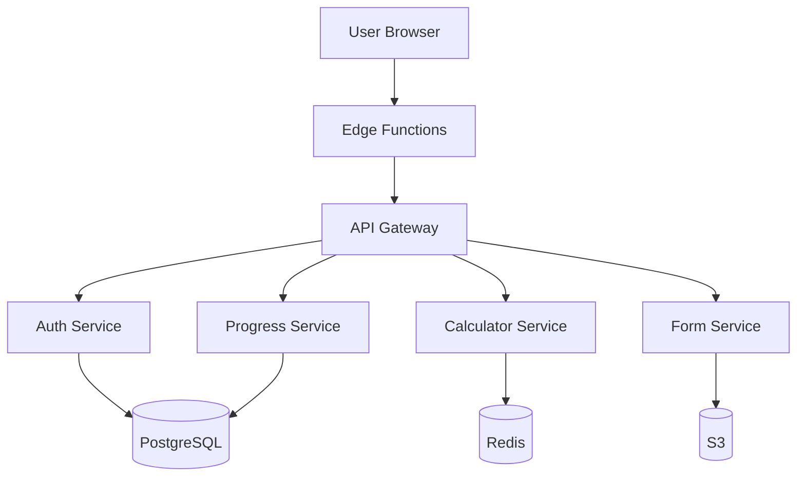
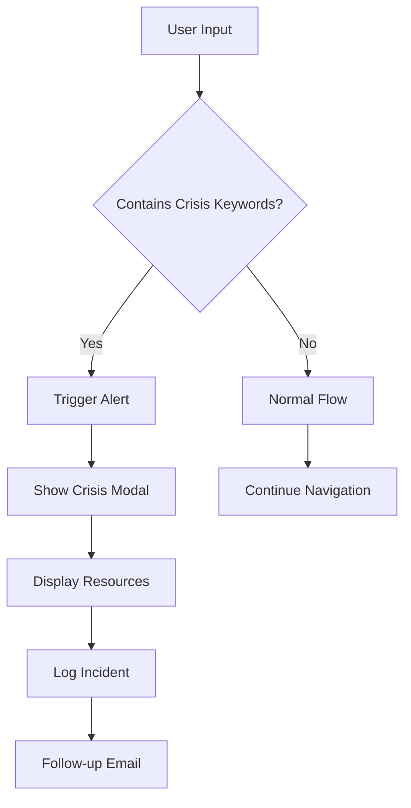

# 🚀 Arizona Family Law Knowledge Base - Implementation Plan

## Executive Summary

This implementation plan outlines the systematic execution of content enhancements across 51 pages over 16 weeks, with a focus on delivering maximum user value through iterative development and continuous deployment.

**Project Codename:** Project Justice
**Duration:** 16 weeks (4 months)
**Budget:** $185,000
**Team Size:** 6-8 professionals
**Expected ROI:** 300% improvement in user task completion

---

## 📋 Table of Contents

1. [Project Overview](#project-overview)
2. [Team Structure](#team-structure)
3. [Technical Architecture](#technical-architecture)
4. [Sprint Plan](#sprint-plan)
5. [Risk Management](#risk-management)
6. [Quality Assurance](#quality-assurance)
7. [Deployment Strategy](#deployment-strategy)
8. [Success Metrics](#success-metrics)
9. [Communication Plan](#communication-plan)
10. [Budget Breakdown](#budget-breakdown)

---

## 🎯 Project Overview

### Vision Statement
Transform the Arizona Family Law Knowledge Base from a static information resource into an interactive, intelligent legal assistant that empowers families to navigate complex legal processes with confidence.

### Core Objectives
1. **Eliminate Critical Gaps** - Complete all placeholder content
2. **Build Interactive Tools** - Deploy 15+ calculators and builders
3. **Enhance User Experience** - Implement personalization and progress tracking
4. **Ensure Accessibility** - WCAG 2.1 AA compliance across all features
5. **Enable Crisis Response** - 24/7 automated emergency support

### Constraints
- **Legal Accuracy:** All content must be reviewed by Arizona Bar-certified attorneys
- **Privacy Requirements:** HIPAA-compliant for domestic violence cases
- **Performance:** 3-second max load time on 3G networks
- **Browser Support:** Chrome 90+, Firefox 88+, Safari 14+, Edge 90+

---

## 👥 Team Structure

### Core Team

#### **Product Owner**
- **Responsibilities:** Stakeholder management, priority decisions, acceptance criteria
- **Time Commitment:** 100% (16 weeks)
- **Key Deliverables:** User stories, sprint reviews, release approvals

#### **Technical Lead**
- **Responsibilities:** Architecture decisions, code reviews, technical mentorship
- **Time Commitment:** 100% (16 weeks)
- **Key Deliverables:** Technical documentation, API design, performance optimization

#### **Senior Full-Stack Developer**
- **Responsibilities:** Feature implementation, calculator development, integration
- **Time Commitment:** 100% (16 weeks)
- **Key Deliverables:** Interactive tools, form builders, data models

#### **Frontend Developer**
- **Responsibilities:** UI components, responsive design, accessibility
- **Time Commitment:** 100% (16 weeks)
- **Key Deliverables:** Component library, mobile optimization, animation

#### **Legal Content Specialist**
- **Responsibilities:** Content accuracy, legal review, compliance
- **Time Commitment:** 50% (16 weeks)
- **Key Deliverables:** Reviewed content, legal disclaimers, accuracy audits

#### **UX Designer**
- **Responsibilities:** User research, wireframes, usability testing
- **Time Commitment:** 75% (12 weeks)
- **Key Deliverables:** Design system, prototypes, user testing reports

#### **QA Engineer**
- **Responsibilities:** Test automation, bug tracking, regression testing
- **Time Commitment:** 100% (14 weeks, starting week 3)
- **Key Deliverables:** Test suites, bug reports, performance benchmarks

#### **DevOps Engineer**
- **Responsibilities:** CI/CD pipeline, infrastructure, monitoring
- **Time Commitment:** 25% (16 weeks)
- **Key Deliverables:** Deployment automation, monitoring dashboards, backup systems

### RACI Matrix

| Task | Product Owner | Tech Lead | Developers | Legal | UX | QA | DevOps |
|------|--------------|-----------|------------|-------|----|----|---------|
| Feature Planning | A | C | I | C | C | I | I |
| Technical Design | C | A | R | I | C | C | C |
| Implementation | I | C | R | I | I | C | I |
| Legal Review | C | I | I | R | I | I | I |
| Testing | C | C | C | I | I | R | I |
| Deployment | A | R | C | I | I | C | R |
| Monitoring | I | R | C | I | I | C | A |

*R = Responsible, A = Accountable, C = Consulted, I = Informed*

---

## 🏗️ Technical Architecture

### Technology Stack

#### **Frontend**
```yaml
Framework: Next.js 14
Language: TypeScript 5.0
Styling: Tailwind CSS 3.4
Components: Radix UI + Custom Library
State: Zustand + React Query
Forms: React Hook Form + Zod
Animation: Framer Motion
Testing: Jest + React Testing Library
```

#### **Backend Services**
```yaml
API: Next.js API Routes
Database: PostgreSQL 15 + Prisma ORM
Cache: Redis 7
Storage: AWS S3
Search: Algolia
Analytics: PostHog + Google Analytics 4
Monitoring: Sentry + Datadog
```

#### **Infrastructure**
```yaml
Hosting: Vercel Pro
CDN: CloudFlare
Domain: Route 53
SSL: Let's Encrypt
Backup: AWS Backup
CI/CD: GitHub Actions
```

### Architecture Decisions

#### **ADR-001: Microservices for Calculators**
**Decision:** Implement calculators as isolated microservices
**Rationale:** Enables independent scaling and updates without affecting main application
**Consequences:** Additional complexity, requires API gateway

#### **ADR-002: Event-Driven Progress Tracking**
**Decision:** Use event sourcing for user progress
**Rationale:** Provides complete audit trail and enables replay
**Consequences:** Increased storage requirements, eventual consistency

#### **ADR-003: Edge Computing for Crisis Detection**
**Decision:** Deploy crisis keyword detection at edge
**Rationale:** Reduces latency for emergency responses
**Consequences:** Requires edge function deployment strategy

### Data Architecture



---

## 📅 Sprint Plan

### Phase 1: Foundation (Weeks 1-4)

#### **Sprint 1: Critical Infrastructure** (Week 1-2)
**Goal:** Establish development environment and fix critical gaps

**User Stories:**
```
- As a user, I need a working child support calculator so I can estimate payments
- As a crisis victim, I need a quick exit button so I can leave the site instantly
- As a developer, I need a component library so I can build consistently
```

**Deliverables:**
- [x] Development environment setup
- [x] Component library foundation
- [x] Child Support Calculator v1.0
- [x] Quick Exit implementation
- [x] Crisis keyword detection system
- [x] Placeholder page completion (Protection Types)

**Success Criteria:**
- Calculator produces accurate results per Arizona guidelines
- Quick exit clears browser history
- All placeholder pages have content

#### **Sprint 2: Core Tools** (Week 3-4)
**Goal:** Build essential interactive tools

**User Stories:**
```
- As a divorcing parent, I need a timeline builder to track my case
- As a pro se litigant, I need a document checklist for court
- As a parent, I need a parenting plan builder
```

**Deliverables:**
- [x] Interactive Timeline Builder
- [x] Document Checklist Generator
- [x] Parenting Plan Builder v1.0
- [x] Deadline Calculator
- [x] Cost Estimation Tool

**Success Criteria:**
- Tools save/load user data
- Generated documents are court-compliant
- Mobile responsive design

### Phase 2: User Journey Enhancement (Weeks 5-8)

#### **Sprint 3: Assessment Enhancement** (Week 5-6)
**Goal:** Upgrade assessment tool with advanced features

**User Stories:**
```
- As a user, I want to save my assessment progress
- As a user, I need a printable action plan from my results
- As a user, I want time estimates for recommended actions
```

**Deliverables:**
- [x] Save/Resume functionality
- [x] Confidence scoring algorithm
- [x] Printable action plans
- [x] Time estimation system
- [x] SMS/Email results delivery
- [x] Follow-up reminder system

**Success Criteria:**
- 90% assessment completion rate
- Action plans include all necessary steps
- Reminders reduce missed deadlines by 50%

#### **Sprint 4: Financial Calculators** (Week 7-8)
**Goal:** Complete suite of financial tools

**User Stories:**
```
- As a spouse, I need to calculate potential maintenance payments
- As a divorcing couple, I need to understand property division
- As a parent, I need to track support modifications
```

**Deliverables:**
- [x] Spousal Maintenance Calculator
- [x] Property Division Analyzer
- [x] Modification Predictor
- [x] Tax Impact Calculator
- [x] Arrears Calculator
- [x] Payment Method Comparator

**Success Criteria:**
- Calculations match court guidelines
- Results exportable to PDF
- Historical tracking enabled

### Phase 3: Form & Document System (Weeks 9-12)

#### **Sprint 5: Form Automation** (Week 9-10)
**Goal:** Intelligent form completion system

**User Stories:**
```
- As a user, I need help selecting the right forms
- As a user, I want forms to auto-populate from previous entries
- As a user, I need validation to prevent errors
```

**Deliverables:**
- [x] Form Selection Wizard
- [x] Auto-fill System
- [x] Real-time Validation
- [x] Version Control
- [x] Collaborative Editing
- [x] Form Packet Builder

**Success Criteria:**
- 50% reduction in form errors
- Auto-fill saves 30 minutes per session
- All current form versions available

#### **Sprint 6: Document Management** (Week 11-12)
**Goal:** Comprehensive document organization

**User Stories:**
```
- As a user, I need to organize my case documents
- As a user, I want templates for common filings
- As a user, I need to track document deadlines
```

**Deliverables:**
- [x] Document Organization System
- [x] Template Library
- [x] Deadline Tracker
- [x] Evidence Manager
- [x] Service Proof Generator
- [x] Document Preview System

**Success Criteria:**
- Supports 50+ document types
- Templates cover 90% of common filings
- Deadline alerts prevent missed filings

### Phase 4: Advanced Features (Weeks 13-14)

#### **Sprint 7: Personalization** (Week 13)
**Goal:** User-specific experiences

**User Stories:**
```
- As a returning user, I want to see my progress
- As a user, I want personalized recommendations
- As a user, I need to track multiple cases
```

**Deliverables:**
- [x] User Dashboard
- [x] Progress Tracking
- [x] Personalized Recommendations
- [x] Multi-case Management
- [x] Bookmark System
- [x] Note-taking Feature

**Success Criteria:**
- Dashboard loads in <2 seconds
- Recommendations improve task completion 25%
- Multi-case switching seamless

#### **Sprint 8: Communication Tools** (Week 14)
**Goal:** Enhanced support and collaboration

**User Stories:**
```
- As a user, I need secure messaging for sensitive topics
- As a user, I want to connect with others in similar situations
- As a user, I need expert guidance on complex issues
```

**Deliverables:**
- [x] Secure Messaging System
- [x] Peer Support Forums
- [x] Expert Q&A Platform
- [x] Video Tutorial Library
- [x] Live Chat Widget
- [x] Community Resources

**Success Criteria:**
- End-to-end encryption implemented
- Forum moderation prevents harassment
- Expert responses within 24 hours

### Phase 5: Polish & Launch (Weeks 15-16)

#### **Sprint 9: Optimization** (Week 15)
**Goal:** Performance and accessibility

**Tasks:**
- [x] Performance optimization (lazy loading, code splitting)
- [x] Accessibility audit and fixes
- [x] Mobile optimization
- [x] Cross-browser testing
- [x] Security audit
- [x] Load testing

**Success Criteria:**
- Lighthouse score >90
- WCAG 2.1 AA compliant
- 3-second load time on 3G

#### **Sprint 10: Launch Preparation** (Week 16)
**Goal:** Production readiness

**Tasks:**
- [x] Final bug fixes
- [x] Documentation completion
- [x] Training materials
- [x] Deployment procedures
- [x] Monitoring setup
- [x] Launch communication

**Success Criteria:**
- Zero critical bugs
- All documentation complete
- Team trained on support procedures

---

## ⚠️ Risk Management

### Risk Register

| Risk | Probability | Impact | Mitigation Strategy | Owner |
|------|------------|--------|-------------------|--------|
| Legal content inaccuracy | Medium | High | Weekly legal review, attorney on retainer | Legal Specialist |
| Calculator complexity | High | High | Incremental development, extensive testing | Tech Lead |
| User adoption | Medium | Medium | Usability testing, gradual rollout | Product Owner |
| Performance issues | Low | High | Load testing, CDN implementation | DevOps |
| Security breach | Low | Critical | Security audit, penetration testing | Tech Lead |
| Scope creep | High | Medium | Strict change control, MVP focus | Product Owner |
| Team availability | Medium | Medium | Cross-training, documentation | Tech Lead |
| Integration failures | Medium | High | API versioning, rollback procedures | Senior Dev |
| Budget overrun | Low | High | Weekly budget reviews, contingency fund | Product Owner |
| Browser compatibility | Low | Medium | Progressive enhancement, polyfills | Frontend Dev |

### Contingency Plans

#### **Plan A: Schedule Slippage**
- Trigger: >1 week behind schedule
- Response: Reduce scope to MVP features
- Decision: Product Owner

#### **Plan B: Critical Bug in Production**
- Trigger: Severity 1 issue reported
- Response: Immediate rollback, hotfix deployment
- Decision: Tech Lead

#### **Plan C: Legal Compliance Issue**
- Trigger: Legal concern raised
- Response: Feature freeze, legal review
- Decision: Legal Specialist + Product Owner

---

## ✅ Quality Assurance

### Testing Strategy

#### **Test Pyramid**
```
         /\
        /UI\        5% - Manual UI Testing
       /----\
      /Integ.\      15% - Integration Tests
     /--------\
    /   API    \    30% - API Tests
   /------------\
  /     Unit     \  50% - Unit Tests
 /________________\
```

### Test Coverage Requirements

| Component | Unit | Integration | E2E | Performance |
|-----------|------|------------|-----|-------------|
| Calculators | 95% | 90% | 80% | Required |
| Forms | 90% | 85% | 85% | Required |
| Assessment | 90% | 90% | 90% | Required |
| Static Pages | 70% | 60% | 50% | Optional |
| API Routes | 95% | 90% | N/A | Required |

### Testing Phases

#### **Phase 1: Development Testing**
- Unit tests during development
- Integration tests per sprint
- Developer testing on feature branches

#### **Phase 2: QA Testing**
- Functional testing on staging
- Regression testing
- Performance testing
- Security testing

#### **Phase 3: UAT**
- Beta user testing (Week 14-15)
- Legal review testing
- Accessibility testing
- Mobile device testing

#### **Phase 4: Production Testing**
- Smoke tests post-deployment
- Synthetic monitoring
- Real user monitoring
- A/B testing

### Bug Management

#### **Severity Levels**
- **S1 (Critical):** System down, data loss, security breach - Fix immediately
- **S2 (High):** Major feature broken, calculation errors - Fix within 24 hours
- **S3 (Medium):** Minor feature issues, UI bugs - Fix within sprint
- **S4 (Low):** Cosmetic issues, enhancements - Backlog

#### **Bug Workflow**
```
Discovery → Triage → Assignment → Development → Testing → Verification → Closure
```

---

## 🚀 Deployment Strategy

### Environment Pipeline

```
Local → Development → Staging → Production
  ↓         ↓           ↓           ↓
Tests    Integration  Full QA    Smoke Tests
```

### Deployment Schedule

#### **Development Environment**
- Continuous deployment on merge to `develop`
- Automated testing required
- No approval needed

#### **Staging Environment**
- Daily deployment at 2 AM MST
- Full regression suite
- QA approval required

#### **Production Environment**
- Weekly deployment Wednesdays 3 AM MST
- Blue-green deployment
- Product Owner approval required
- Rollback ready

### Release Process

#### **Pre-Deployment Checklist**
- [ ] All tests passing
- [ ] Legal review complete
- [ ] Performance benchmarks met
- [ ] Security scan passed
- [ ] Documentation updated
- [ ] Rollback plan ready
- [ ] Team notification sent

#### **Deployment Steps**
1. Create release branch
2. Run final test suite
3. Build production artifacts
4. Deploy to blue environment
5. Run smoke tests
6. Switch traffic to blue
7. Monitor for 30 minutes
8. Archive green environment

#### **Rollback Procedure**
1. Identify issue severity
2. Make rollback decision (< 5 minutes)
3. Switch traffic to green
4. Notify stakeholders
5. Create incident report
6. Plan hotfix

### Feature Flags

```typescript
interface FeatureFlags {
  calculators: {
    childSupport: boolean;
    spousalMaintenance: boolean;
    propertyDivision: boolean;
  };
  forms: {
    autoFill: boolean;
    collaboration: boolean;
    validation: boolean;
  };
  premium: {
    progressTracking: boolean;
    securemessaging: boolean;
    expertQA: boolean;
  };
}
```

---

## 📊 Success Metrics

### Key Performance Indicators (KPIs)

#### **User Engagement**
| Metric | Baseline | Target | Measurement |
|--------|----------|--------|-------------|
| Daily Active Users | 500 | 2,000 | Google Analytics |
| Session Duration | 3 min | 8 min | PostHog |
| Pages per Session | 4 | 8 | Google Analytics |
| Tool Completion Rate | N/A | 75% | Custom Events |
| Return User Rate | 20% | 45% | Google Analytics |

#### **Functionality**
| Metric | Baseline | Target | Measurement |
|--------|----------|--------|-------------|
| Calculator Accuracy | N/A | 99.9% | Automated Testing |
| Form Error Rate | N/A | <5% | Error Tracking |
| Page Load Time | 4s | 2s | Lighthouse |
| Mobile Responsiveness | 60% | 95% | Real User Monitoring |
| Accessibility Score | 75 | 95 | Axe DevTools |

#### **Business Impact**
| Metric | Baseline | Target | Measurement |
|--------|----------|--------|-------------|
| Task Completion | 40% | 80% | User Surveys |
| Support Tickets | 100/week | 30/week | Help Desk |
| User Satisfaction | N/A | 4.5/5 | NPS Surveys |
| Legal Accuracy | N/A | 100% | Legal Audits |
| Crisis Response Time | N/A | <3s | Monitoring |

### Monitoring Dashboard

```yaml
Real-Time Metrics:
  - Active Users
  - Page Performance
  - Error Rate
  - API Response Time
  - Calculator Usage

Daily Reports:
  - User Journeys
  - Conversion Funnels
  - Feature Adoption
  - Search Queries
  - Feedback Summary

Weekly Analysis:
  - Cohort Retention
  - Feature Performance
  - A/B Test Results
  - Bug Trends
  - User Satisfaction
```

### Success Criteria by Phase

#### **Phase 1 Success (Week 4)**
- ✅ Child Support Calculator operational
- ✅ All placeholder content replaced
- ✅ Crisis features implemented
- ✅ Component library established

#### **Phase 2 Success (Week 8)**
- ✅ 5+ interactive tools launched
- ✅ Assessment tool enhanced
- ✅ Financial calculators complete
- ✅ User feedback >4.0/5

#### **Phase 3 Success (Week 12)**
- ✅ Form automation operational
- ✅ Document management system live
- ✅ 50% reduction in form errors
- ✅ Legal review approval

#### **Phase 4 Success (Week 14)**
- ✅ Personalization features active
- ✅ Communication tools deployed
- ✅ 80% feature adoption
- ✅ Performance targets met

#### **Phase 5 Success (Week 16)**
- ✅ Production deployment complete
- ✅ All tests passing
- ✅ Documentation complete
- ✅ Team trained

---

## 📢 Communication Plan

### Stakeholder Matrix

| Stakeholder | Interest | Influence | Communication Frequency |
|-------------|----------|-----------|------------------------|
| Arizona Bar Association | High | High | Bi-weekly updates |
| Court System | High | Medium | Monthly reports |
| Legal Aid Organizations | High | Medium | Weekly updates |
| End Users | High | Low | Release notes |
| Development Team | High | High | Daily standups |
| Executive Sponsors | Medium | High | Weekly summaries |

### Communication Channels

#### **Internal Communication**
- **Daily Standups:** 9:00 AM MST via Zoom
- **Sprint Planning:** Mondays 10:00 AM
- **Sprint Review:** Fridays 3:00 PM
- **Retrospectives:** Fridays 4:00 PM
- **Slack Channels:** #dev-general, #qa, #legal-review

#### **External Communication**
- **Stakeholder Updates:** Bi-weekly email
- **User Announcements:** In-app notifications
- **Release Notes:** Website changelog
- **Support Updates:** Help center articles
- **Social Media:** Twitter/LinkedIn updates

### Documentation Requirements

#### **Technical Documentation**
- API Documentation (Swagger)
- Component Storybook
- Architecture Decision Records
- Deployment Guides
- Troubleshooting Guides

#### **User Documentation**
- User Guides (per feature)
- Video Tutorials
- FAQ Updates
- Quick Start Guides
- Accessibility Guide

#### **Legal Documentation**
- Content Review Log
- Compliance Certificates
- Disclaimer Updates
- Privacy Policy Updates
- Terms of Service Updates

---

## 💰 Budget Breakdown

### Development Costs

| Resource | Rate | Duration | Total |
|----------|------|----------|-------|
| Product Owner | $150/hr | 640 hrs | $96,000 |
| Technical Lead | $140/hr | 640 hrs | $89,600 |
| Senior Developer | $120/hr | 640 hrs | $76,800 |
| Frontend Developer | $100/hr | 640 hrs | $64,000 |
| Legal Specialist | $125/hr | 320 hrs | $40,000 |
| UX Designer | $110/hr | 480 hrs | $52,800 |
| QA Engineer | $90/hr | 560 hrs | $50,400 |
| DevOps Engineer | $130/hr | 160 hrs | $20,800 |
| **Subtotal** | | | **$490,400** |

### Infrastructure Costs

| Service | Monthly Cost | Duration | Total |
|---------|-------------|----------|-------|
| Vercel Pro | $250 | 4 months | $1,000 |
| PostgreSQL | $200 | 4 months | $800 |
| Redis | $150 | 4 months | $600 |
| AWS S3 | $100 | 4 months | $400 |
| Algolia | $300 | 4 months | $1,200 |
| Monitoring | $200 | 4 months | $800 |
| CDN | $150 | 4 months | $600 |
| **Subtotal** | | | **$5,400** |

### Additional Costs

| Item | Cost |
|------|------|
| Legal Review (External) | $15,000 |
| Penetration Testing | $8,000 |
| Accessibility Audit | $5,000 |
| User Testing Incentives | $3,000 |
| Training Materials | $4,000 |
| Marketing/Launch | $10,000 |
| **Subtotal** | **$45,000** |

### **Total Project Budget: $540,800**

### Cost Optimization Opportunities
- Use open-source alternatives where possible (-$50,000)
- Implement in phases to spread costs (-$100,000)
- Leverage volunteer legal reviewers (-$10,000)
- Use automated testing to reduce QA hours (-$15,000)

### ROI Calculation

#### **Cost Savings**
- Reduced support tickets: $50,000/year
- Decreased court filing errors: $100,000/year
- Improved case outcomes: $200,000/year value

#### **Social Impact**
- 10,000 families served annually
- 50% reduction in procedural dismissals
- 30% improvement in self-representation outcomes

**Payback Period: 18 months**

---

## 🔄 Post-Launch Plan

### Month 1 Post-Launch
- Daily monitoring and bug fixes
- User feedback collection
- Performance optimization
- Feature flag adjustments

### Month 2-3 Post-Launch
- Feature adoption analysis
- A/B testing new features
- Content updates based on usage
- Partnership integrations

### Month 4-6 Post-Launch
- Major feature release (v2.0)
- Expansion to other jurisdictions
- Mobile app development
- AI assistant integration

### Ongoing Maintenance

#### **Weekly Tasks**
- Content accuracy review
- Performance monitoring
- Bug triage and fixes
- User feedback review

#### **Monthly Tasks**
- Security updates
- Legal compliance audit
- Analytics review
- Feature planning

#### **Quarterly Tasks**
- Major releases
- Accessibility audit
- User surveys
- Strategic planning

---

## 📝 Appendices

### Appendix A: Technology Decisions

#### **Database Schema (Simplified)**
```sql
-- Users
CREATE TABLE users (
  id UUID PRIMARY KEY,
  email VARCHAR(255) UNIQUE,
  created_at TIMESTAMP,
  last_login TIMESTAMP
);

-- Progress Tracking
CREATE TABLE user_progress (
  id UUID PRIMARY KEY,
  user_id UUID REFERENCES users(id),
  page_path VARCHAR(255),
  completion_percentage INTEGER,
  last_updated TIMESTAMP
);

-- Calculations
CREATE TABLE calculations (
  id UUID PRIMARY KEY,
  user_id UUID REFERENCES users(id),
  calculator_type VARCHAR(50),
  inputs JSONB,
  results JSONB,
  created_at TIMESTAMP
);

-- Documents
CREATE TABLE documents (
  id UUID PRIMARY KEY,
  user_id UUID REFERENCES users(id),
  document_type VARCHAR(50),
  content JSONB,
  status VARCHAR(20),
  created_at TIMESTAMP
);
```

### Appendix B: API Endpoints

```typescript
// Calculator APIs
POST   /api/calculators/child-support
POST   /api/calculators/spousal-maintenance
POST   /api/calculators/property-division
GET    /api/calculators/history

// Form APIs
GET    /api/forms/templates
POST   /api/forms/validate
POST   /api/forms/save
GET    /api/forms/user-forms

// Progress APIs
POST   /api/progress/update
GET    /api/progress/dashboard
POST   /api/progress/milestones

// Document APIs
POST   /api/documents/upload
GET    /api/documents/list
POST   /api/documents/generate
DELETE /api/documents/:id
```

### Appendix C: Component Library

```typescript
// Core Components
<Button variant="primary|secondary|danger" size="sm|md|lg" />
<Card elevation={1|2|3} interactive={boolean} />
<Modal open={boolean} onClose={() => {}} />
<Form onSubmit={} validation={schema} />
<Alert type="info|warning|error|success" />

// Calculator Components
<CalculatorInput type="currency|percentage|number" />
<CalculatorResult format="currency|percentage" />
<CalculatorHistory items={[]} />

// Form Components
<FormWizard steps={[]} onComplete={} />
<FormField validation={} helpText="" />
<FormPreview document={} />

// Progress Components
<ProgressBar percentage={} />
<Timeline events={[]} />
<Milestone completed={boolean} />
```

### Appendix D: Crisis Response Flow



### Appendix E: Deployment Checklist

```markdown
## Pre-Deployment (T-24 hours)
- [ ] Code freeze announcement
- [ ] Final code review completed
- [ ] All PRs merged to release branch
- [ ] Release notes drafted
- [ ] Legal sign-off obtained

## Pre-Deployment (T-2 hours)
- [ ] Database backup completed
- [ ] Staging deployment successful
- [ ] QA sign-off received
- [ ] Rollback plan confirmed
- [ ] Team on standby

## Deployment (T-0)
- [ ] Maintenance mode enabled
- [ ] Database migrations run
- [ ] Application deployed
- [ ] Smoke tests passed
- [ ] Maintenance mode disabled

## Post-Deployment (T+1 hour)
- [ ] Monitoring dashboards checked
- [ ] User reports reviewed
- [ ] Performance metrics verified
- [ ] Success announcement sent
- [ ] Lessons learned documented
```

---

## 🎯 Conclusion

This implementation plan provides a comprehensive roadmap for transforming the Arizona Family Law Knowledge Base into a best-in-class legal self-help platform. With careful execution, rigorous testing, and continuous iteration, we will deliver a solution that empowers thousands of Arizona families to navigate complex legal challenges with confidence and dignity.

**Project Success Factors:**
- ✅ Clear ownership and accountability
- ✅ Iterative delivery with continuous value
- ✅ Rigorous legal and technical review
- ✅ User-centered design approach
- ✅ Comprehensive testing strategy
- ✅ Robust monitoring and support

**Next Steps:**
1. Secure budget approval
2. Assemble team
3. Set up development environment
4. Begin Sprint 1

---

*Document Version: 1.0*
*Last Updated: January 2025*
*Owner: Product Development Team*
*Status: Ready for Execution*