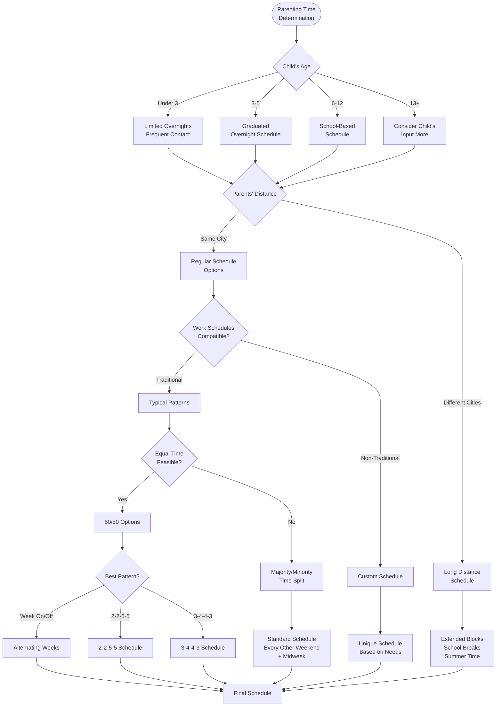
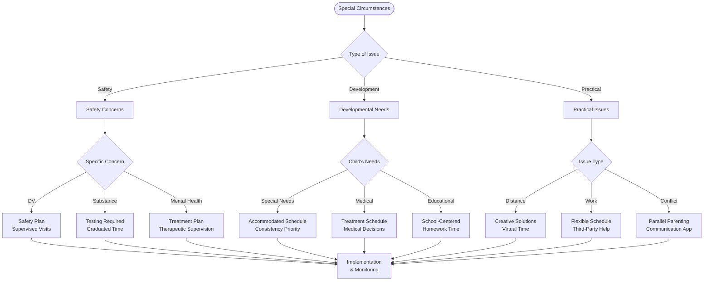
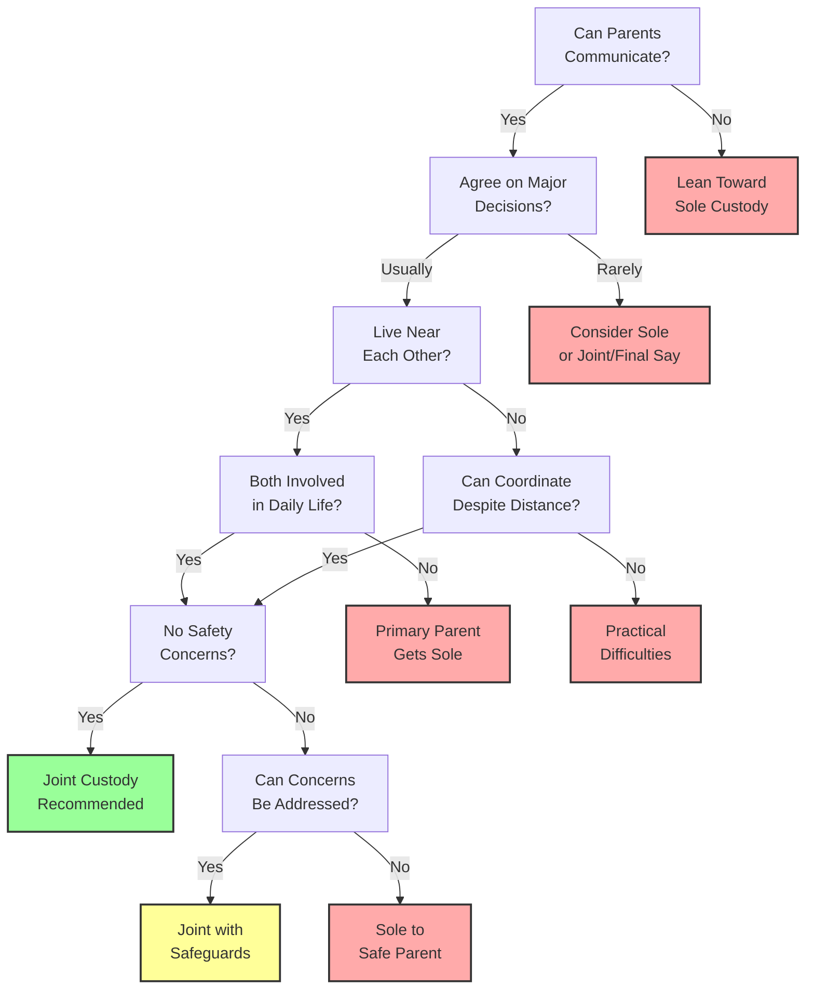
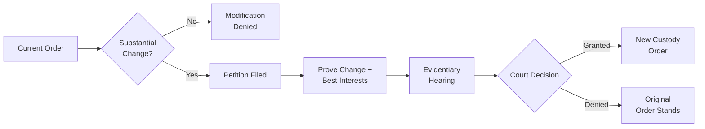
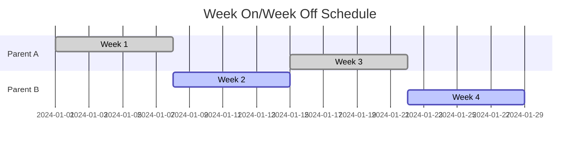
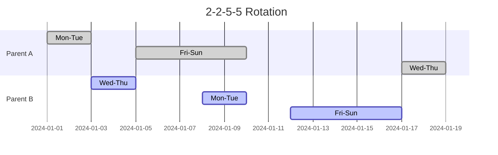

# Child Custody Decision Flowchart

## 🔍 Visual Overview

This flowchart illustrates how Arizona courts determine legal decision-making (custody) and parenting time arrangements based on the best interests of the child.

## 📊 Legal Decision-Making Process

```mermaid
flowchart TD
    Start([Custody Case Begins]) --> DV{Domestic Violence<br/>History?}
    
    DV -->|Yes - Significant| DVPresumption[Presumption Against<br/>Joint Custody]
    DV -->|No/Minor| Factors[Evaluate Best<br/>Interest Factors]
    
    DVPresumption --> Overcome{Can Perpetrator<br/>Overcome Presumption?}
    Overcome -->|No| Sole[Sole Legal<br/>Decision-Making<br/>to Victim]
    Overcome -->|Yes| Factors
    
    Factors --> Agreement{Parents Agree?}
    Agreement -->|Yes| Review[Court Reviews<br/>Agreement]
    Agreement -->|No| Evaluation
    
    Review --> BestInt1{Serves Child's<br/>Best Interests?}
    BestInt1 -->|Yes| Approve[Approve Agreement]
    BestInt1 -->|No| Modify[Court Modifies<br/>or Rejects]
    
    Evaluation --> Evidence[Consider Evidence]
    Evidence --> Factors2[Apply A.R.S. § 25-403 Factors]
    
    Factors2 --> Joint{Joint Custody<br/>Appropriate?}
    Joint -->|Yes| JointOptions[Determine Type]
    Joint -->|No| SoleOptions[Determine Sole Parent]
    
    JointOptions --> JointType{Type of Joint}
    JointType -->|Equal| JointEqual[Joint Equal<br/>Decision-Making]
    JointType -->|Final Say| JointFinal[Joint with<br/>Final Say]
    
    SoleOptions --> Primary{Which Parent?}
    Primary -->|Mother| SoleMother[Sole to Mother]
    Primary -->|Father| SoleFather[Sole to Father]
    
    Modify --> Factors2
    Approve --> ParentingTime
    JointEqual --> ParentingTime
    JointFinal --> ParentingTime
    SoleMother --> ParentingTime
    SoleFather --> ParentingTime
    Sole --> ParentingTime
    
    ParentingTime[Determine<br/>Parenting Time]
    
    style Start fill:#f9f,stroke:#333,stroke-width:4px
    style DVPresumption fill:#faa,stroke:#333,stroke-width:2px
    style Sole fill:#faa,stroke:#333,stroke-width:2px
```

## 🏛️ Best Interest Factors Analysis

```mermaid
flowchart LR
    subgraph "A.R.S. § 25-403 Factors"
        F1[Relationships]
        F2[Wishes]
        F3[Adjustment]
        F4[Health]
        F5[Cooperation]
        F6[Coercion]
        F7[Primary Care]
        F8[Substance Abuse]
        F9[Domestic Violence]
        F10[False Reporting]
        F11[Other Factors]
    end
    
    F1 --> Score[Weighted<br/>Analysis]
    F2 --> Score
    F3 --> Score
    F4 --> Score
    F5 --> Score
    F6 --> Score
    F7 --> Score
    F8 --> Score
    F9 --> Score
    F10 --> Score
    F11 --> Score
    
    Score --> Decision[Custody<br/>Decision]
```

## ⏰ Parenting Time Determination

## 🚨 Special Circumstances

## 📋 Decision Tree: Joint vs Sole Custody

## 🔄 Modification Process

## 📊 Common Custody Arrangements

### Equal Parenting Time (50/50)

### 2-2-5-5 Schedule

## 💡 Key Considerations

### For Parents
1. **Focus on child's needs**, not winning
2. **Document everything** - interactions, concerns
3. **Be flexible** when reasonable
4. **Communicate respectfully**
5. **Follow court orders** exactly

### For Children
1. **Age-appropriate schedules**
2. **Consistency and routine**
3. **Both parents involved**
4. **Minimal transitions**
5. **School/activity focus**

### Red Flags 🚩
- Undermining other parent
- Inflexibility
- Safety concerns
- Substance abuse
- Mental health crises
- Domestic violence

## 🔗 Related Resources

- [Child Custody Guide](../core-topics/Child Custody.md)
- [Parenting Time Details](../special-situations/Parenting Time.md)
- [Modification Process](../resources/Post-Decree Issues.md)
- [Best Interests Factors](../core-topics/Child Custody.md#best-interests-standard)

## 📞 Get Help

- **Custody Evaluators**: Court-appointed experts
- **Parenting Coordinators**: High-conflict help
- **Family Therapists**: Child adjustment
- **Legal Aid**: If you qualify

---

**Navigation**: [← Divorce Process Flowchart](Divorce Process Flowchart.md) | [Property Division Flowchart →](Property Division Flowchart.md)

*Last updated: December 30, 2024*