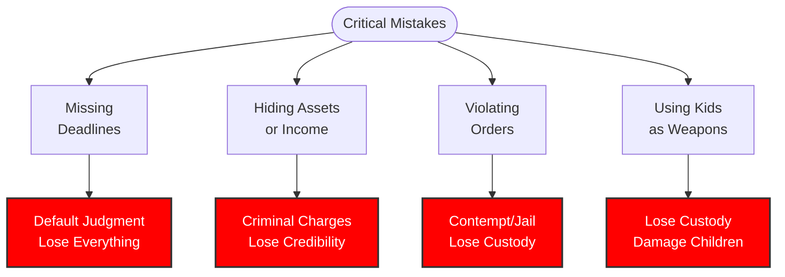
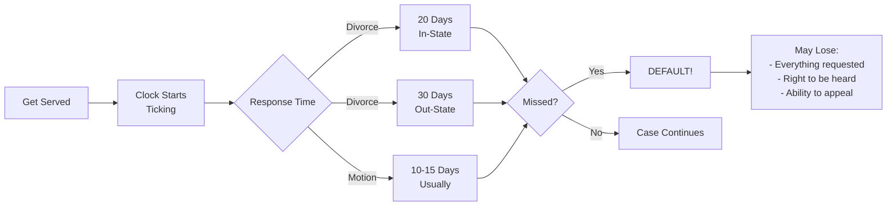
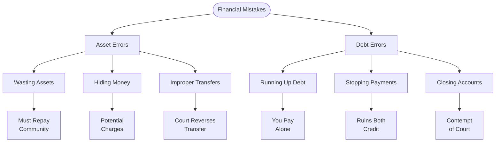
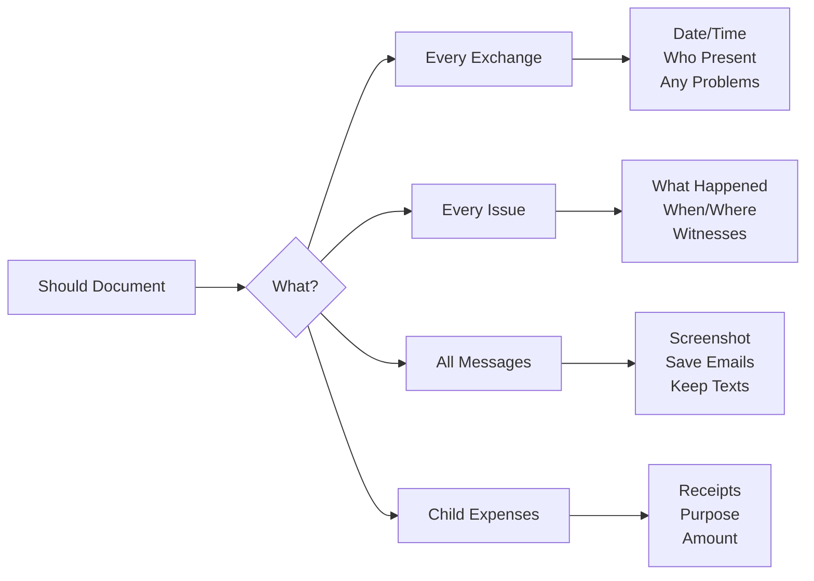
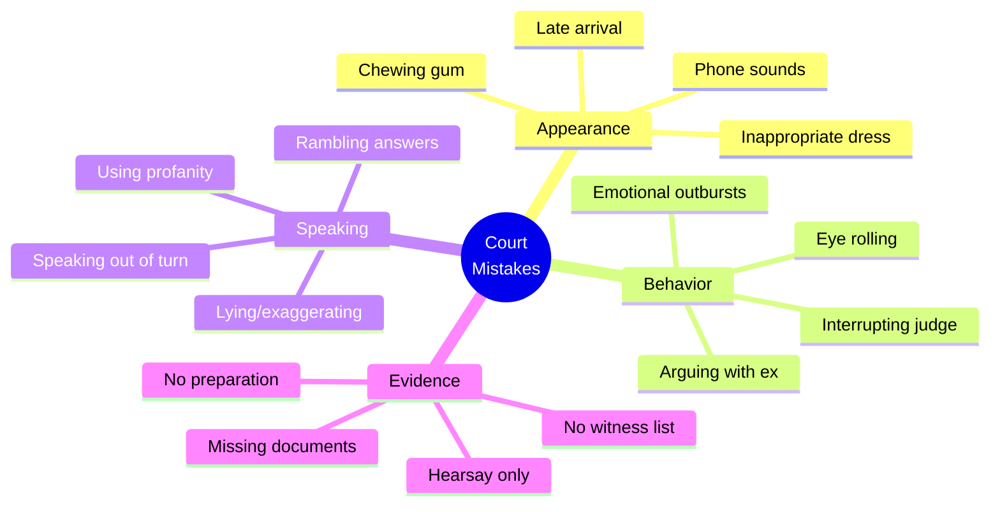
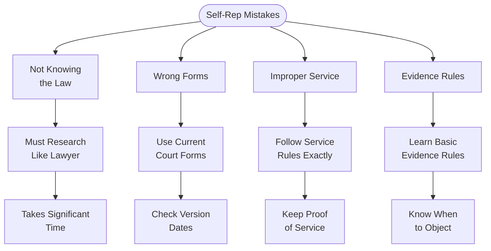
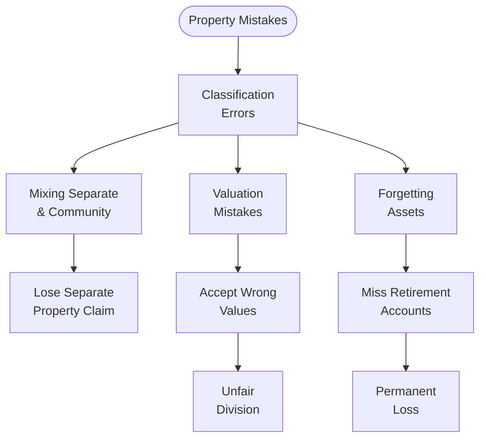
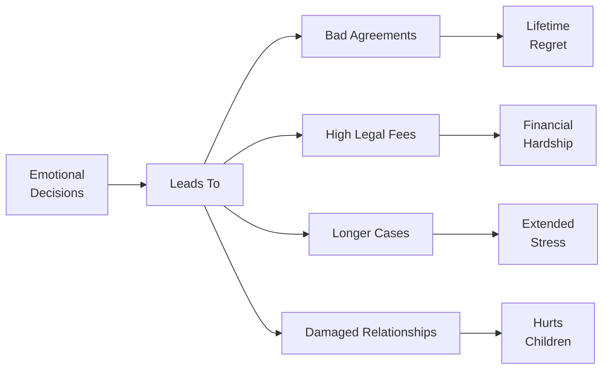
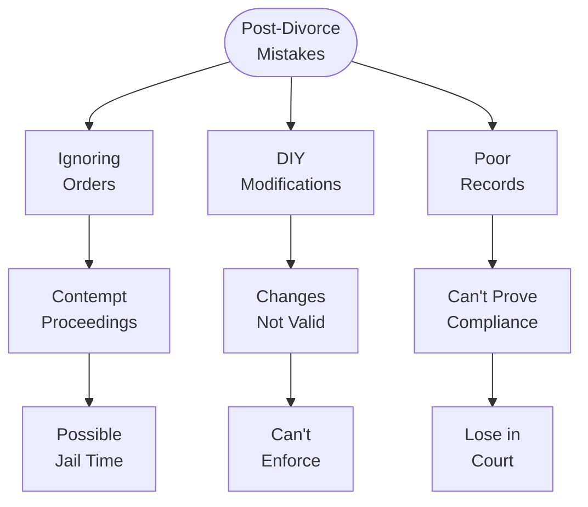
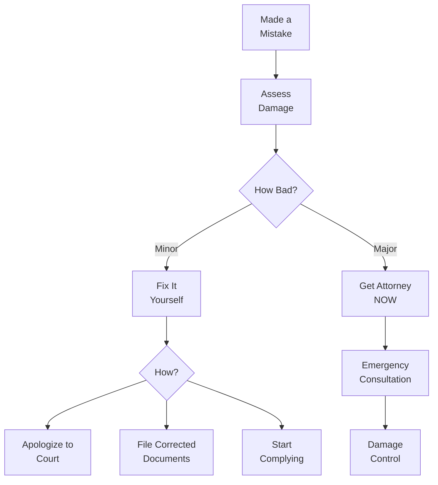

# Common Mistakes to Avoid

## ⚠️ Overview

This guide identifies the most common and costly mistakes people make in Arizona family law cases. Learning from others' errors can save you time, money, and heartache.

## 🚨 Critical Mistakes That Can Lose Your Case

## 📅 Deadline Mistakes

### Missing Response Deadlines

### How to Avoid
- ✅ **Calendar immediately** when served
- ✅ **Set multiple reminders**
- ✅ **File response 5 days early**
- ✅ **Get help if confused**
- ✅ **Request extension if needed**

## 💰 Financial Mistakes

### Common Financial Errors

| Mistake | Consequences | How to Avoid |
|---------|-------------|--------------|
| **Hiding assets** | Criminal charges, lose credibility | Full disclosure always |
| **Spending spree** | Pay it back, attorney fees | Follow preliminary injunction |
| **Quitting job** | Imputed income, contempt | Keep working |
| **Not documenting** | Can't prove expenses | Save all receipts |
| **Joint account raids** | Must account, return half | Take only your share |
| **Secret credit cards** | Still community debt | Disclose everything |

### Asset & Debt Mistakes

## 👨‍👩‍👧 Parenting Mistakes

### Using Children as Weapons

**Never Do This:**
- ❌ Bad-mouth other parent
- ❌ Quiz kids about other home
- ❌ Use kids as messengers
- ❌ Withhold visitation
- ❌ Alienate children
- ❌ Involve kids in conflict

**Consequences:**
- Lose custody
- Supervised visitation
- Parenting classes ordered
- Attorney fees
- Damage children permanently

### Documentation Failures

## ⚖️ Court Behavior Mistakes

### Courtroom Don'ts

### Social Media Disasters

**Fatal Facebook Mistakes:**
1. **Party photos** during custody battle
2. **New purchases** while claiming poverty
3. **Threatening posts** about ex
4. **Dating profiles** before divorce final
5. **Venting** about judge or case

**Protection Strategy:**
- 🔒 Maximum privacy settings
- 🤐 No case discussion online
- 📵 No photos that look bad
- 🚫 Block your ex
- ⏸️ Consider social media break

## 📝 Legal Process Mistakes

### Self-Representation Errors

### Settlement Mistakes

**Common Settlement Errors:**

| Mistake | Why It Happens | Prevention |
|---------|----------------|------------|
| **Agreeing too quickly** | Want it over | Sleep on it |
| **No legal review** | Save money | Big mistake |
| **Vague language** | Seems okay now | Be specific |
| **Forgetting issues** | Overwhelmed | Use checklist |
| **Unfair terms** | Guilt/pressure | Know your rights |
| **No enforcement** | Trust other party | Build in remedies |

## 🏠 Property Division Mistakes

### Classification Errors

### Overlooked Assets
- ❌ Retirement accounts
- ❌ Stock options
- ❌ Deferred compensation
- ❌ Business interests
- ❌ Intellectual property
- ❌ Tax refunds
- ❌ Cryptocurrency

## 💔 Emotional Mistakes

### Letting Emotions Control

### Emotional Control Tips
1. **Wait 24 hours** before responding
2. **Have trusted friend** review messages
3. **Focus on future**, not past
4. **Consider counseling**
5. **Practice self-care**
6. **Remember the goal**

## 🚫 Post-Divorce Mistakes

### Common Post-Decree Errors

### Modification Mistakes
- ❌ Verbal agreements only
- ❌ Changing without court order
- ❌ Not documenting changes
- ❌ Ignoring substantial change requirement
- ❌ Filing too soon
- ❌ No evidence of change

## 📋 Mistake Prevention Checklist

### Before Filing
- [ ] Research the law
- [ ] Gather all documents
- [ ] Consider legal consultation
- [ ] Understand the process
- [ ] Plan finances
- [ ] Prepare emotionally

### During Case
- [ ] Meet all deadlines
- [ ] Follow all orders
- [ ] Document everything
- [ ] Stay off social media
- [ ] Communicate properly
- [ ] Focus on children

### In Court
- [ ] Dress appropriately
- [ ] Arrive early
- [ ] Bring all documents
- [ ] Tell the truth
- [ ] Stay calm
- [ ] Follow protocol

### After Court
- [ ] Follow orders exactly
- [ ] Keep good records
- [ ] Communicate properly
- [ ] Seek modifications legally
- [ ] Pay on time
- [ ] Co-parent effectively

## 🆘 Fixing Mistakes

### If You've Made a Mistake

### Recovery Steps
1. **Acknowledge** the mistake
2. **Stop** the harmful behavior
3. **Assess** the damage
4. **Get help** if needed
5. **Fix** what you can
6. **Learn** from it

## 💡 Golden Rules

### The 10 Commandments of Family Law

1. **Thou shalt not** miss deadlines
2. **Thou shalt not** hide assets
3. **Thou shalt not** violate orders
4. **Thou shalt not** use children as weapons
5. **Thou shalt not** lie to the court
6. **Thou shalt not** act on emotion
7. **Thou shalt not** forget documentation
8. **Thou shalt not** ignore legal advice
9. **Thou shalt not** post on social media
10. **Thou shalt not** take justice into own hands

## 🔗 Related Resources

- [Self-Representation Guide](Self-Representation Guide.md)
- [Court Forms Assistant](Court Forms Assistant.md)
- [Legal Research Guide](Legal Research Guide.md)
- [DV Safety Planning](DV Safety Planning Flowchart.md)

## 📞 Emergency Help

If you've made a serious mistake:
- **Legal Aid**: 1-866-637-5341
- **State Bar Referral**: 602-257-4434
- **Court Self-Help**: Check county website
- **Crisis Line**: 988

---

**Navigation**: [← Legal Research Guide](Legal Research Guide.md) | [FAQ →](../reference/FAQ.md)

*Last updated: December 30, 2024*

**Remember: Everyone makes mistakes. What matters is fixing them properly.**