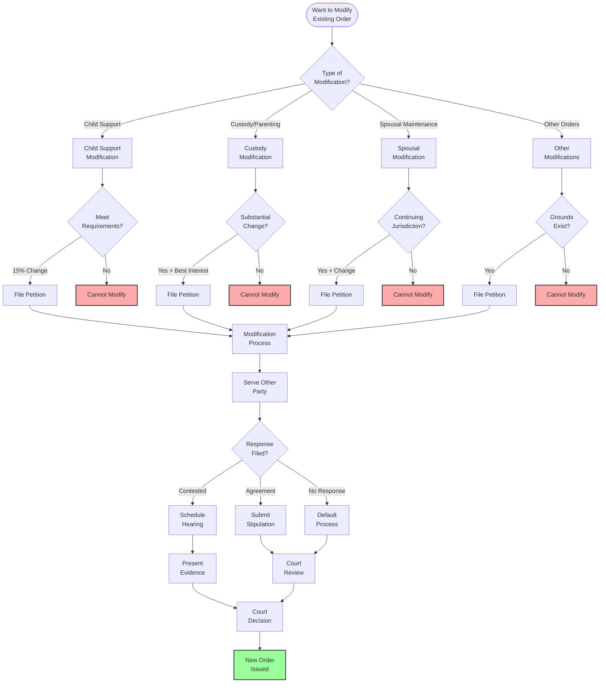
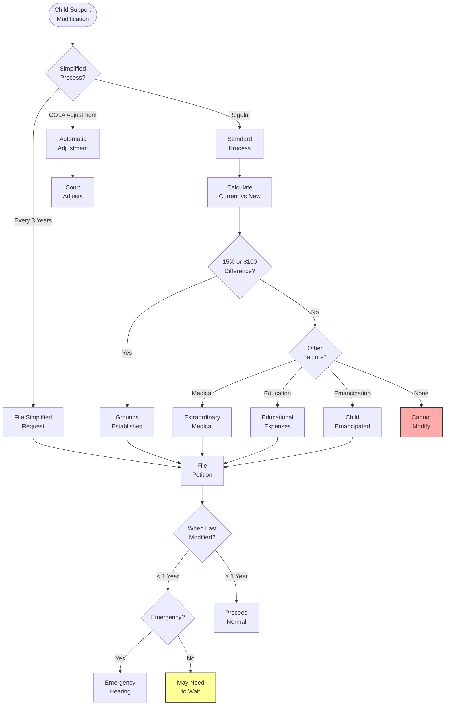
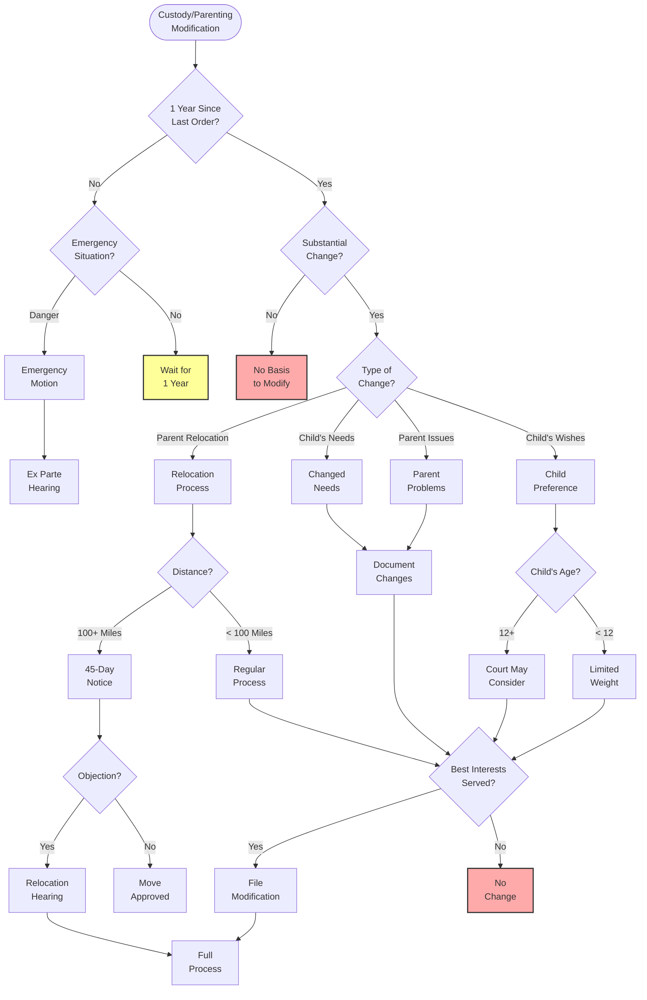
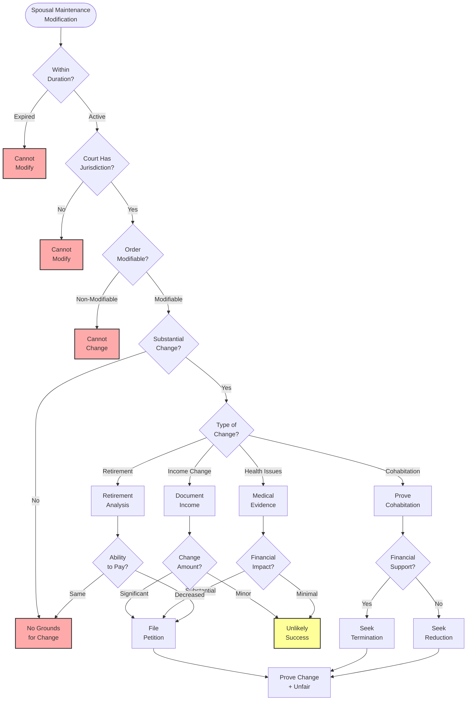
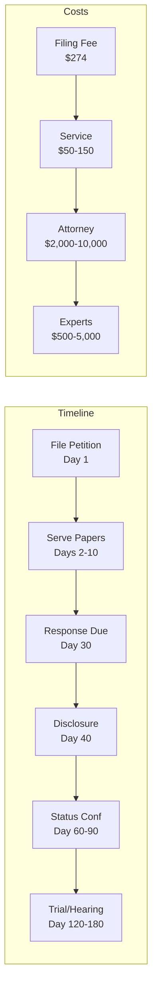
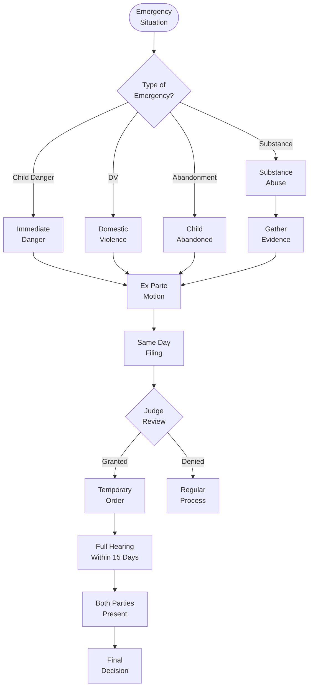
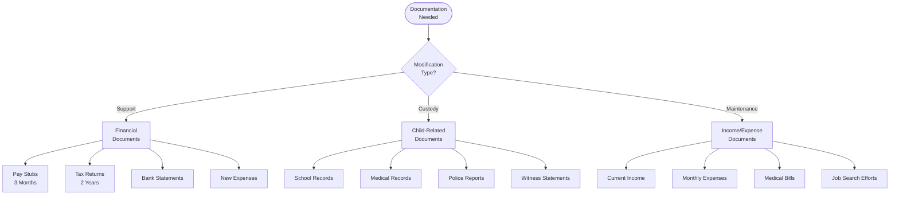
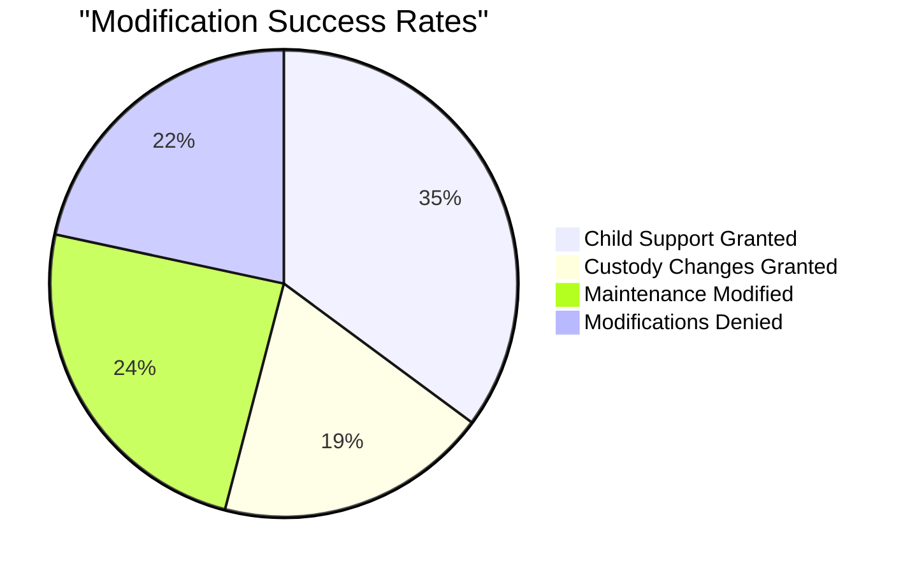
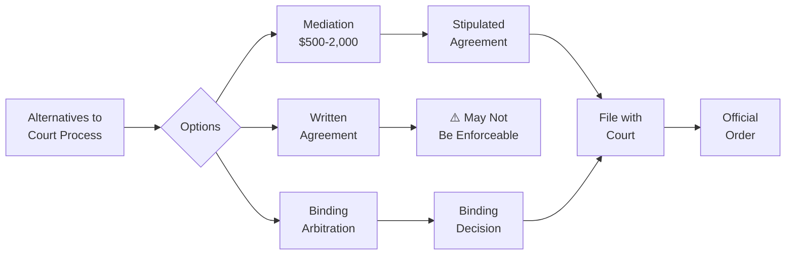

# Modification Process Flowchart

## 🔍 Visual Overview

This flowchart illustrates the process for modifying existing family law orders in Arizona, including the requirements, procedures, and timelines for different types of modifications.

## 📊 General Modification Process

## 💰 Child Support Modification Requirements

## 👨‍👩‍👧 Custody/Parenting Time Modification

## 💵 Spousal Maintenance Modification

## 📋 Modification Timeline & Costs

## 🚨 Emergency Modifications

## 📝 Required Documentation

## 💡 Success Factors

### Likely to Succeed ✅
1. **Significant income change** (>15% for support)
2. **Documented safety concerns**
3. **Major health changes**
4. **Child's documented needs**
5. **Agreement between parties**

### Unlikely to Succeed ❌
1. **Minor inconveniences**
2. **Disagreement with order**
3. **No substantial change**
4. **Recent modification** (<1 year)
5. **Failure to follow current order**

## 📊 Modification Statistics

## 🔄 Alternative to Court Modification

## 📋 Modification Checklist

### Before Filing
- [ ] Read current order completely
- [ ] Document substantial changes
- [ ] Calculate financial differences
- [ ] Gather supporting evidence
- [ ] Consider mediation first
- [ ] Consult with attorney

### Filing Process
- [ ] Complete correct forms
- [ ] Pay filing fee ($274)
- [ ] Attach evidence
- [ ] File with same court
- [ ] Serve other party properly
- [ ] Meet all deadlines

### After Filing
- [ ] Respond to discovery
- [ ] Attend all hearings
- [ ] Bring evidence to court
- [ ] Follow temporary orders
- [ ] Update financial info
- [ ] Comply with new order

## 🔗 Related Resources

- [Post-Decree Issues Guide](Post-Decree Issues.md)
- [Child Support Modification Forms](Forms and Documents.md#modification-forms)
- [Custody Modification Guide](../core-topics/Child Custody.md#modifications)
- [Emergency Orders](../procedures/Emergency Orders.md)

## 📞 Get Help

- **Self-Help Center**: Court assistance
- **Legal Aid**: If you qualify
- **Private Attorneys**: Complex cases
- **Mediators**: Agreement help

---

**Navigation**: [← Property Division Flowchart](Property Division Flowchart.md) | [Forms and Documents →](Forms and Documents.md)

*Last updated: December 30, 2024*