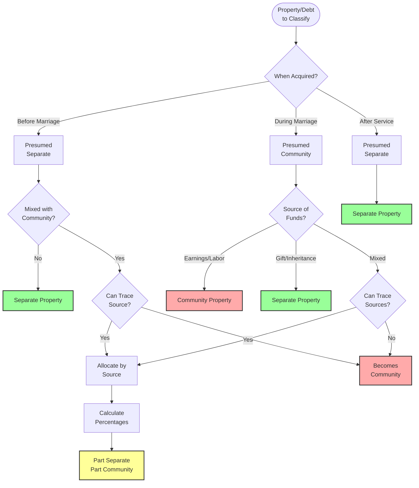
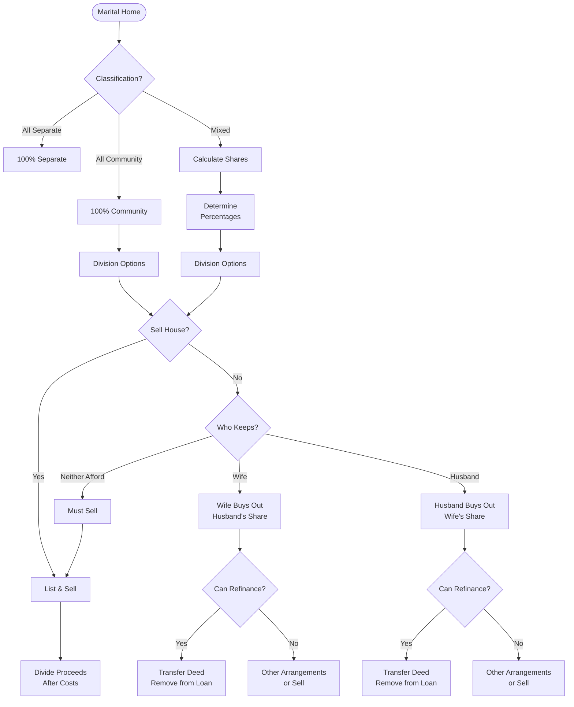
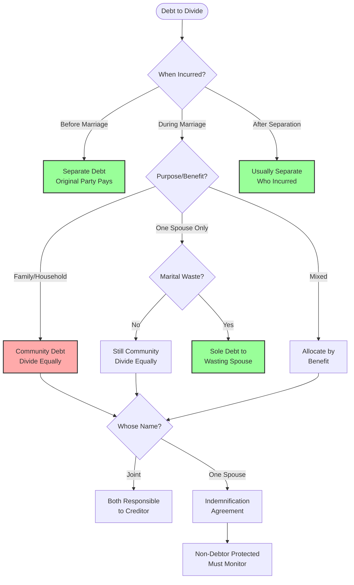
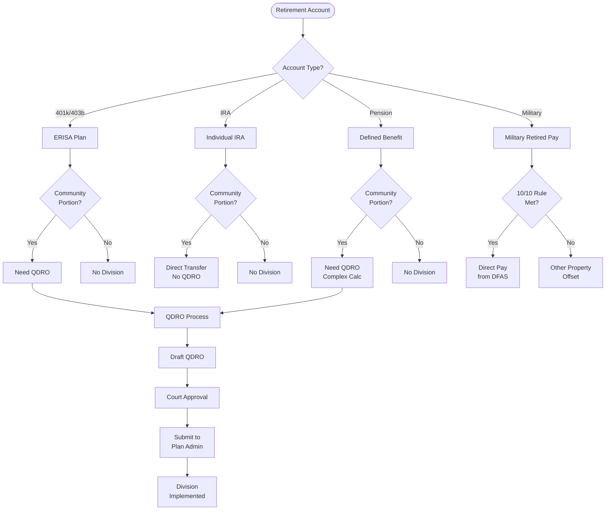
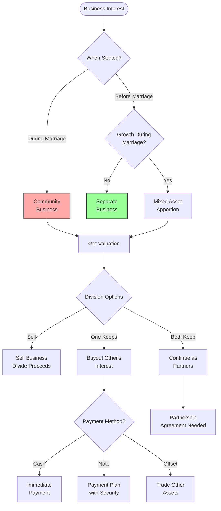
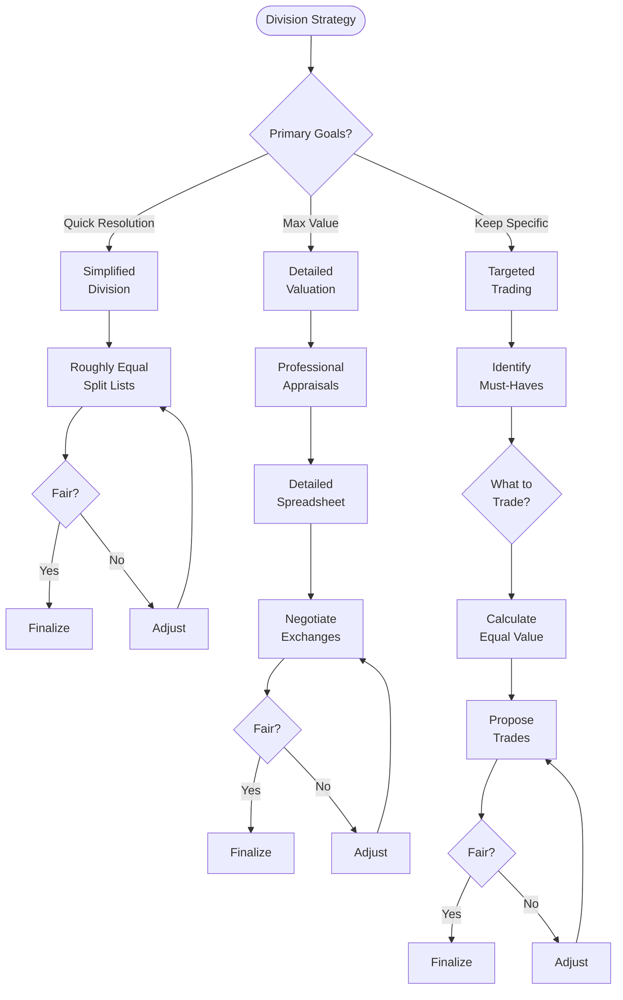
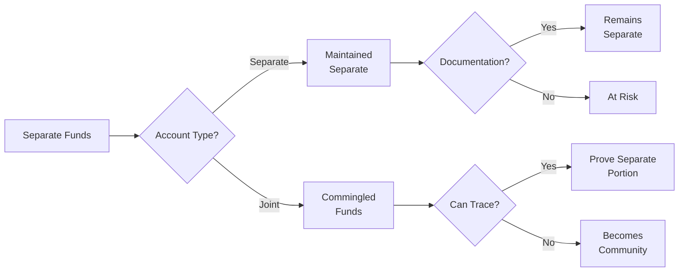
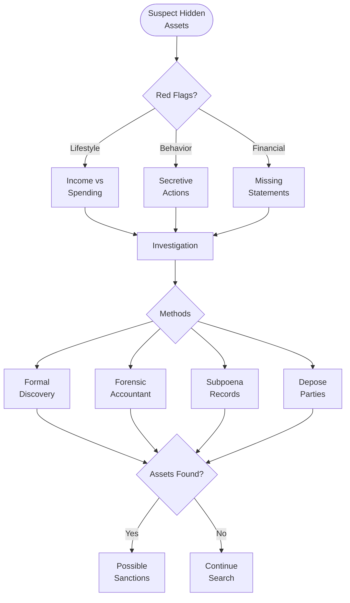
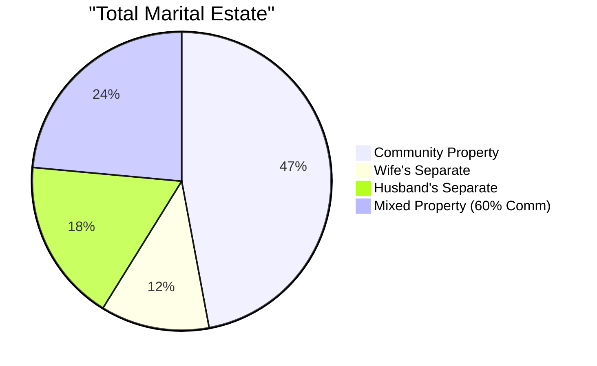

# Property Division Flowchart

## 🔍 Visual Overview

This flowchart shows how Arizona courts classify and divide property and debts in divorce cases using community property principles.

## 📊 Property Classification Process



## 🏠 Real Estate Division



## 💳 Debt Division Process



## 💰 Retirement Account Division



## ⚖️ Business Division



## 📋 Division Strategy Flowchart



## 🎯 Special Considerations

### Tracing Separate Property



### Hidden Assets Search



## 📊 Property Division Examples

### Example 1: Simple Division

```mermaid
pie title "Community Property Pool"
    "House Equity" : 300000
    "401k Accounts" : 200000
    "Vehicles" : 50000
    "Bank Accounts" : 50000
    "Credit Card Debt" : -20000
```

**Total**: $580,000 ÷ 2 = $290,000 each

### Example 2: Complex Division with Separate



## 💡 Division Tips

### Do's ✅
1. **List everything** - Even small items
2. **Get appraisals** - For valuable items
3. **Consider taxes** - Capital gains, etc.
4. **Think long-term** - Maintenance costs
5. **Document agreements** - In writing

### Don'ts ❌
1. **Hide assets** - Severe penalties
2. **Waste assets** - Court can compensate
3. **Ignore debts** - Still responsible
4. **Forget QDROs** - For retirement
5. **Rush decisions** - Take time

## 🔗 Related Resources

- [Property Division Guide](../core-topics/Property Division.md)
- [Property Division Worksheet](Property Division Worksheet.md)
- [Business Valuation](../additional-topics/Business Valuation.md)
- [Tax Considerations](Tax Considerations.md)
- [QDRO Information](../core-topics/Property Division.md#retirement-accounts-qdros)

## 📞 Get Help

- **Appraisers**: Real estate, personal property
- **Business Valuators**: CVA, ABV certified
- **Forensic Accountants**: Hidden asset search
- **QDRO Specialists**: Retirement division

---

**Navigation**: [← Child Custody Flowchart](Child Custody Flowchart.md) | [Modification Process Flowchart →](Modification Process Flowchart.md)

*Last updated: December 30, 2024*