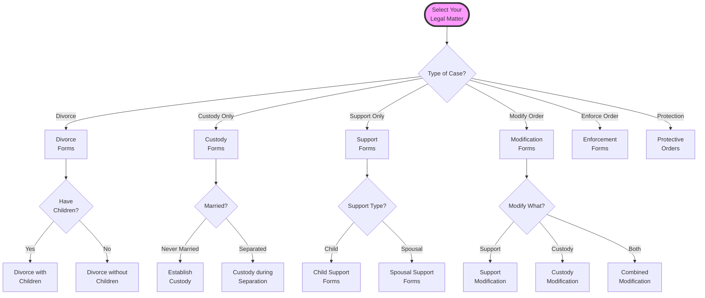
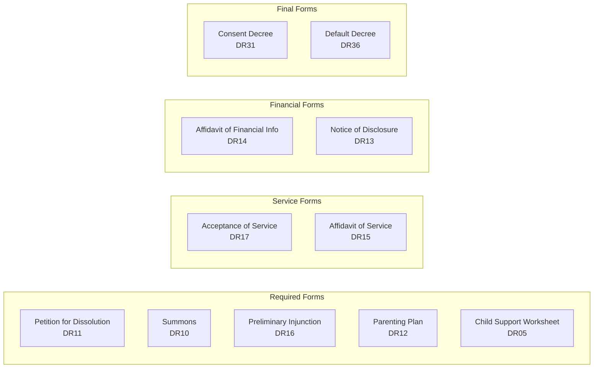
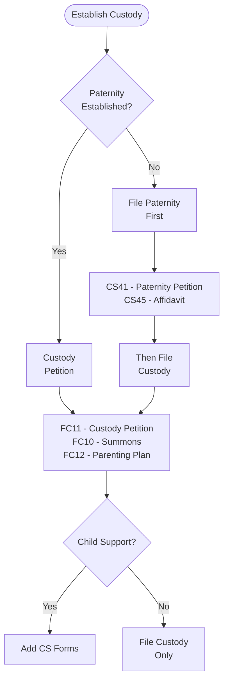
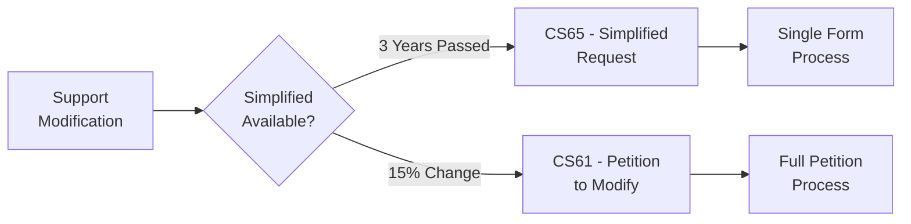
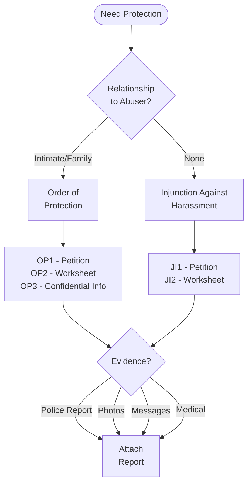
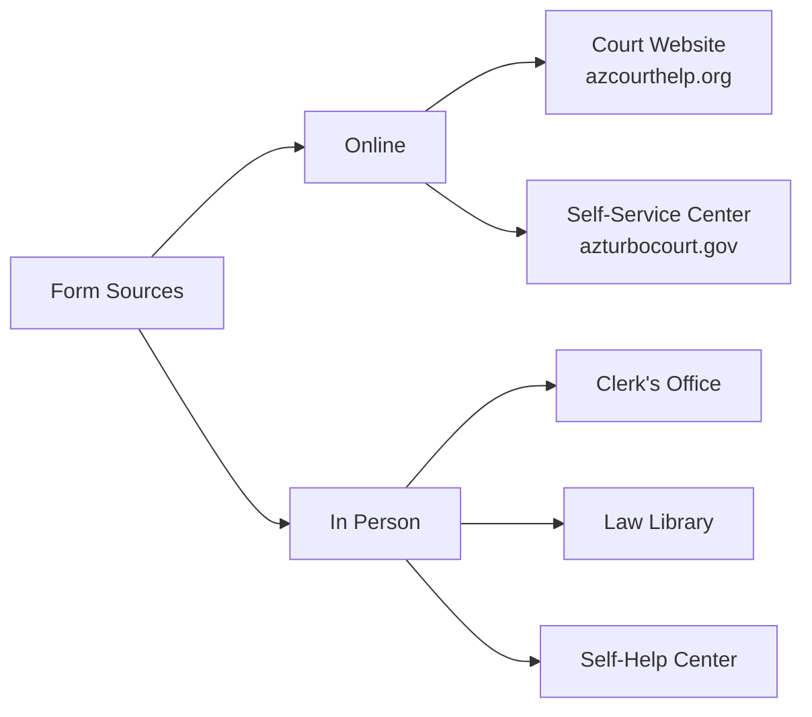
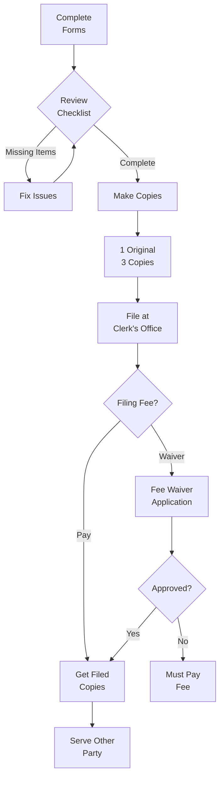

# Court Forms Assistant

## 🔍 Form Finder Tool

This interactive guide helps you identify exactly which forms you need for your family law matter in Arizona.

## 📊 What Do You Need Forms For?

## 📋 Divorce Forms Package

### Divorce WITH Children

**Complete Package Includes:**

| Form Number | Form Name | When to File | Required? |
|------------|-----------|--------------|-----------|
| DR11 | Petition for Dissolution (With Children) | Start case | ✅ Yes |
| DR10 | Summons | With petition | ✅ Yes |
| DR16 | Preliminary Injunction | With petition | ✅ Yes |
| DR01 | Sensitive Data Sheet | With petition | ✅ Yes |
| DRCVG1 | Cover Sheet | With petition | ✅ Yes |
| DR12 | Parenting Plan | With petition or later | ✅ Yes |
| DR05 | Child Support Worksheet | Before decree | ✅ Yes |
| DR14 | Affidavit of Financial Information | 40 days after filing | ✅ Yes |
| DR15 | Affidavit of Service | After service | If not accepted |
| DR17 | Acceptance of Service | Instead of formal service | Optional |
| DR31/DR36 | Decree of Dissolution | End of case | ✅ Yes |

### Divorce WITHOUT Children

**Simplified Package:**

| Form Number | Form Name | When to File | Required? |
|------------|-----------|--------------|-----------|
| DR21 | Petition for Dissolution (No Children) | Start case | ✅ Yes |
| DR20 | Summons | With petition | ✅ Yes |
| DR26 | Preliminary Injunction | With petition | ✅ Yes |
| DR01 | Sensitive Data Sheet | With petition | ✅ Yes |
| DRCVG1 | Cover Sheet | With petition | ✅ Yes |
| DR24 | Affidavit of Financial Information | 40 days after filing | ✅ Yes |
| DR25 | Affidavit of Service | After service | If needed |
| DR27 | Acceptance of Service | Instead of formal service | Optional |
| DR41/DR46 | Decree of Dissolution | End of case | ✅ Yes |

## 🧒 Custody-Only Forms

### Establishing Custody (Never Married)

**Required Forms:**

| Form Number | Form Name | Purpose |
|------------|-----------|---------|
| FC11 | Petition to Establish Custody | Start custody case |
| FC10 | Summons | Notify other parent |
| FC01 | Sensitive Data Sheet | Protect private info |
| FCCVG1 | Cover Sheet | Court filing |
| FC12 | Parenting Plan | Propose schedule |
| DR05 | Child Support Worksheet | If requesting support |
| FC14 | Order to Appear | Schedule hearing |

## 💰 Support Forms

### Child Support Establishment

**Initial Filing:**
- CS11 - Petition to Establish Support
- CS10 - Summons
- CS05 - Child Support Worksheet
- CS14 - Financial Affidavit

### Child Support Modification

**Modification Forms:**

| Circumstance | Form Number | Form Name |
|--------------|-------------|-----------|
| Every 3 years | CS65 | Simplified Request |
| 15% change | CS61 | Petition to Modify |
| With custody mod | DR91 | Combined Modification |
| Emergency | CS63 | Emergency Motion |

## 🛡️ Protective Order Forms

## 📝 Form Preparation Checklist

### Before You Start
- [ ] **Case Number** (if modifying)
- [ ] **Full Legal Names** of all parties
- [ ] **Dates** (marriage, separation, birth)
- [ ] **Addresses** (current and for service)
- [ ] **Children's Information**
  - [ ] Full names
  - [ ] Birthdates
  - [ ] Social Security Numbers

### Financial Information
- [ ] **Income Documentation**
  - [ ] Pay stubs (3 months)
  - [ ] Tax returns (2 years)
  - [ ] Self-employment records
- [ ] **Asset Information**
  - [ ] Real estate values
  - [ ] Vehicle information
  - [ ] Account balances
  - [ ] Retirement accounts
- [ ] **Debt Details**
  - [ ] Credit card balances
  - [ ] Loan information
  - [ ] Monthly payments

### For Custody Cases
- [ ] **Proposed Schedule**
- [ ] **School Information**
- [ ] **Healthcare Providers**
- [ ] **Special Needs** (if any)
- [ ] **Extracurricular Activities**

## 💡 Form Tips by Type

### Petitions
- **Use black ink** or type
- **Be specific** but concise
- **Check all applicable boxes**
- **Don't leave blanks** - write N/A
- **Sign in front of notary**

### Financial Affidavits
- **Be completely honest**
- **Include all income sources**
- **List all expenses**
- **Attach proof**
- **Update if changes occur**

### Parenting Plans
- **Be detailed** about schedule
- **Include holidays**
- **Address special occasions**
- **Plan for changes**
- **Consider child's age**

## 🔄 Common Form Mistakes

### Top 10 Mistakes to Avoid

1. **Wrong form version** - Always use current forms
2. **Missing signatures** - Check every signature line
3. **No notarization** - Many forms require notary
4. **Incomplete information** - Fill out completely
5. **Wrong court** - File in correct county
6. **Missing copies** - Keep copies of everything
7. **No case number** - Include on all documents
8. **Illegible writing** - Print clearly or type
9. **Missing attachments** - Include all exhibits
10. **Wrong filing fee** - Verify current amounts

## 📍 Where to Get Forms

### Official Sources

### County-Specific Forms

**Maricopa County**
- Website: superiorcourt.maricopa.gov
- Self-Service Center: 602-506-7353
- Multiple locations

**Pima County**
- Website: sc.pima.gov
- Self-Service Center: 520-724-3255
- Law Library: 520-724-8456

**Other Counties**
- Check county superior court website
- Visit local courthouse
- Call clerk's office

## 🚀 Form Filing Process

## 📱 Electronic Filing

### Benefits
- File 24/7
- Immediate confirmation
- No travel required
- Track case online
- Automatic calculations

### Requirements
- Email address
- Credit card (for fees)
- Scanner or photos
- PDF capability
- Digital signature

### Available for
- ✅ Divorce petitions
- ✅ Responses
- ✅ Financial affidavits
- ✅ Most motions
- ❌ Some emergency orders
- ❌ Sealed documents

## 🆘 Form Help Resources

### Free Assistance
1. **Court Self-Help Centers**
   - Form selection help
   - Basic completion guidance
   - Computer access
   - Printing services

2. **Legal Aid Organizations**
   - Income-qualified assistance
   - Form completion help
   - Limited representation

3. **Law Libraries**
   - Form books
   - Legal guides
   - Computer access
   - Copy services

### Paid Services
1. **Document Preparation Services**
   - $200-500 typically
   - Forms only, no legal advice
   - Check certification

2. **Limited Scope Attorneys**
   - Form review
   - Specific guidance
   - Hourly rates

## 🔗 Related Resources

- [Forms and Documents Guide](Forms and Documents.md)
- [Court Procedures](../procedures/Court Procedures.md)
- [Legal Representation Options](../procedures/Legal Representation.md)
- [Filing Fee Information](../procedures/Court Procedures.md#filing-fees)

## 📞 Get Help

- **Court Self-Help**: Check county website
- **Legal Aid**: 1-866-637-5341
- **State Bar Referral**: 602-257-4434
- **Document Preparers**: Check certification

---

**Navigation**: [← DV Safety Planning Flowchart](DV Safety Planning Flowchart.md) | [Self-Representation Guide →](Self-Representation Guide.md)

*Last updated: December 30, 2024*