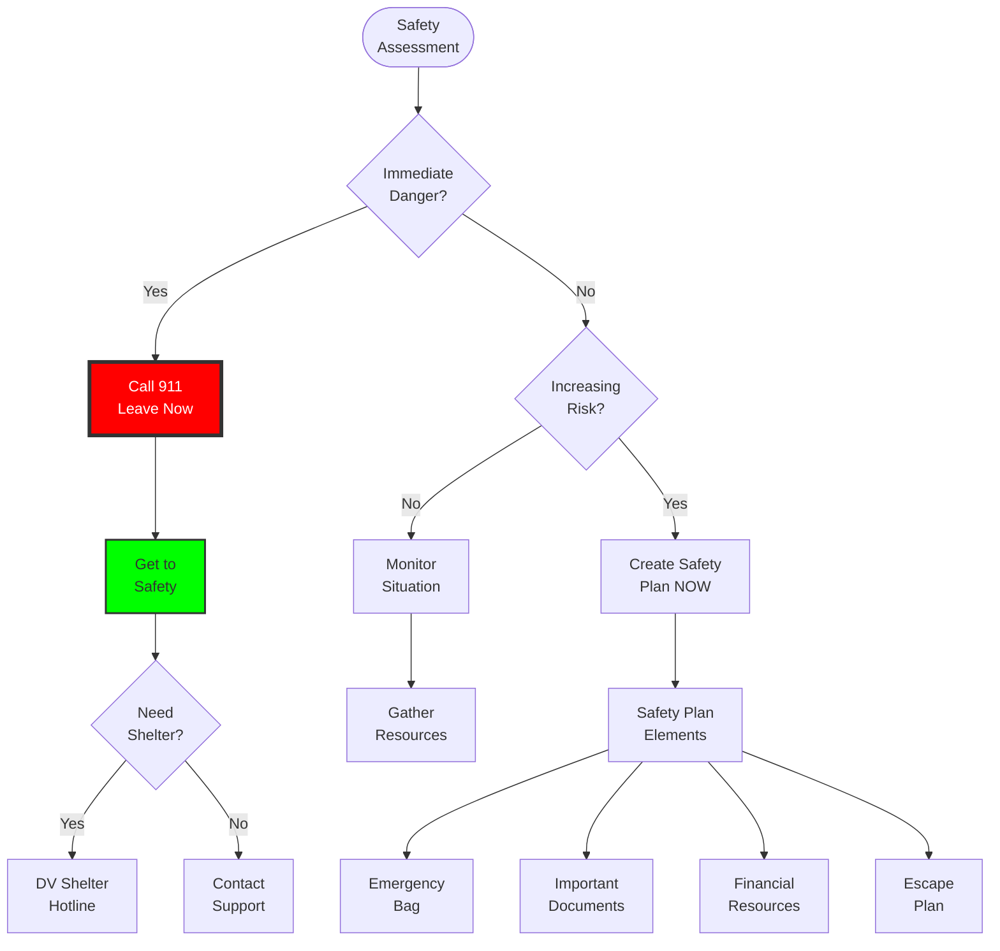
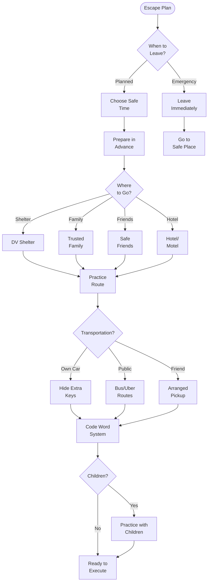
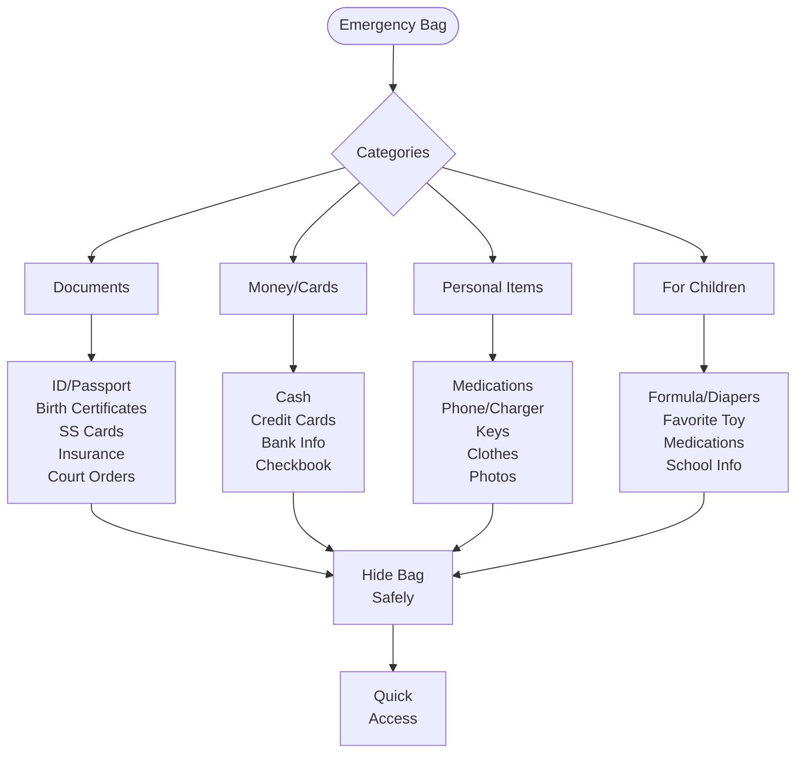
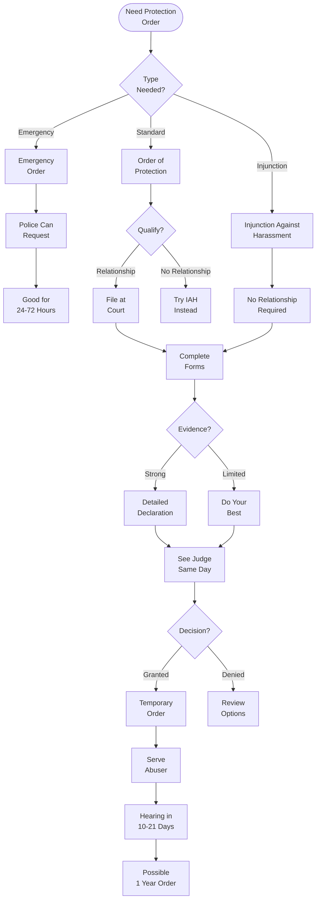
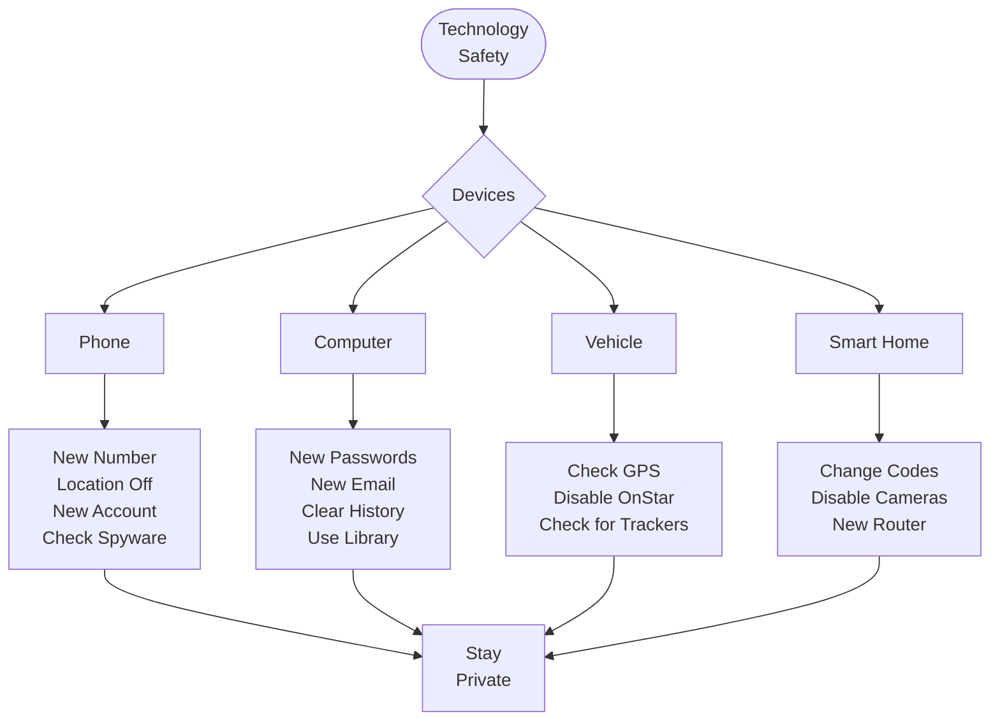
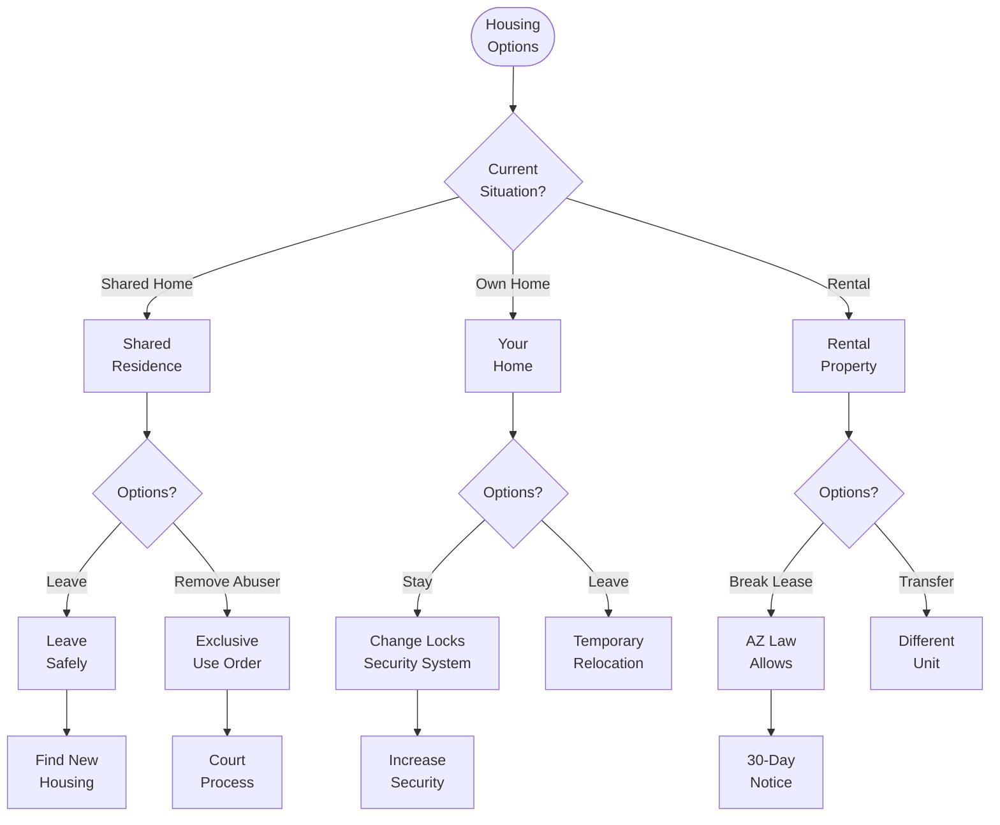
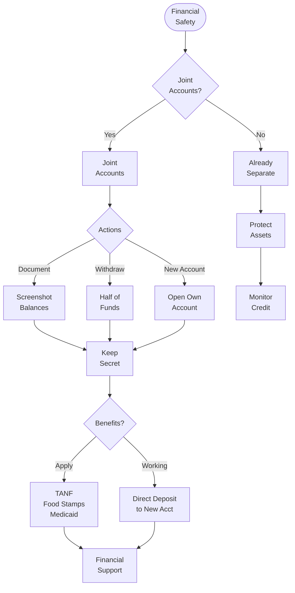
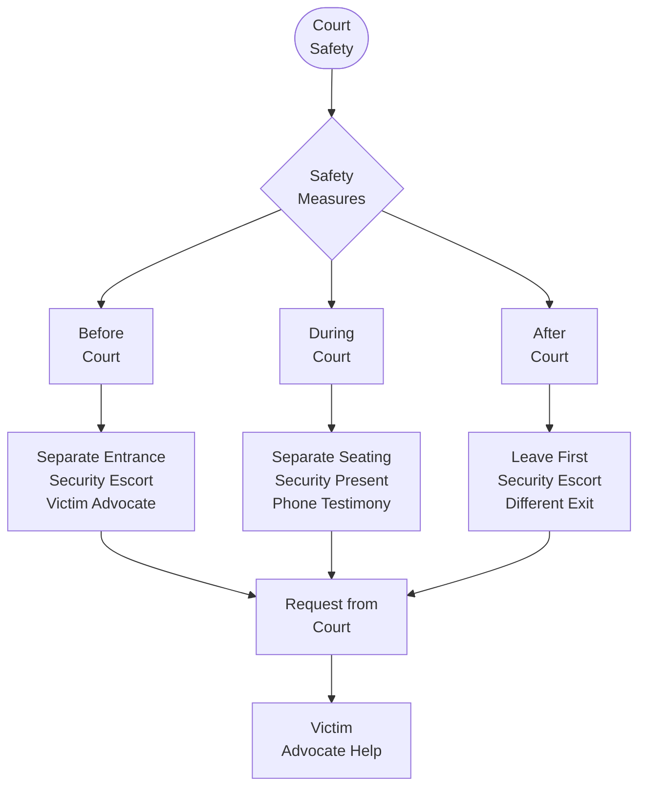

# Domestic Violence Safety Planning Flowchart

## ⚠️ Immediate Safety

**If you are in immediate danger, call 911**

National Domestic Violence Hotline: **1-800-799-7233** (24/7, free, confidential)
Arizona Coalition to End Sexual & Domestic Violence: **602-279-2900**

## 🔍 Safety Assessment

## 🏃 Creating an Escape Plan

## 📦 Emergency Bag Checklist

## 🛡️ Protective Order Process

## 📱 Technology Safety

## 🏠 Housing Safety Options

## 💰 Financial Safety

## 🏛️ Court Safety Measures

## 📋 Safety Plan Worksheet

### At Home
- [ ] Identify safe rooms (with locks/exits)
- [ ] Keep phone accessible
- [ ] Teach children to call 911
- [ ] Create code word for danger
- [ ] Plan escape routes
- [ ] Keep car fueled
- [ ] Hide spare keys
- [ ] Pack emergency bag

### Leaving
- [ ] Choose safe time
- [ ] Have destination ready
- [ ] Take children if safe
- [ ] Take emergency bag
- [ ] Turn off phone location
- [ ] Use cash not cards
- [ ] Don't go to predictable places
- [ ] Call DV hotline

### After Leaving
- [ ] Change phone number
- [ ] New email accounts
- [ ] Close joint accounts
- [ ] Change all passwords
- [ ] Inform work/school
- [ ] Vary daily routes
- [ ] Consider protection order
- [ ] Document everything

## 🆘 Emergency Resources

### 24/7 Hotlines
- **National DV Hotline**: 1-800-799-7233
- **Arizona Coalition**: 602-279-2900
- **Legal Aid**: 1-866-637-5341
- **Crisis Text Line**: Text HOME to 741741

### Phoenix Area Shelters
- **Chrysalis**: 602-955-9059
- **Sojourner Center**: 602-244-0089
- **My Sister's Place**: 602-263-6461
- **UMOM**: 602-275-7852

### Tucson Area
- **Emerge!**: 520-888-7777
- **Sister Jose**: 520-909-3905

### Statewide
- **Against Abuse**: 1-800-782-6400
- **Catholic Charities**: 602-997-6105

## 💻 Online Safety Resources

### Delete History
1. **Chrome**: Ctrl+Shift+Delete
2. **Safari**: History → Clear History
3. **Firefox**: Ctrl+Shift+Delete
4. **Use Incognito/Private Mode**

### Safe Computers
- Public library
- Friend's device
- Work computer (carefully)
- New tablet/phone

### Email Safety
- Create new account
- Use different password
- Don't use real name
- Access from safe computer

## 🔗 Related Resources

- [Domestic Violence Guide](../special-situations/Domestic Violence.md)
- [Emergency Orders](../procedures/Emergency Orders.md)
- [Legal Representation](../procedures/Legal Representation.md)
- [Court Procedures](../procedures/Court Procedures.md)

## 📞 Remember

- **You are not alone**
- **It's not your fault**
- **Help is available**
- **You deserve safety**
- **There is hope**

---

**Navigation**: [← Parenting Plan Flowchart](Parenting Plan Flowchart.md) | [Tax Considerations →](Tax Considerations.md)

*Last updated: December 30, 2024*

**This information could save lives. Please share with those who need it.**