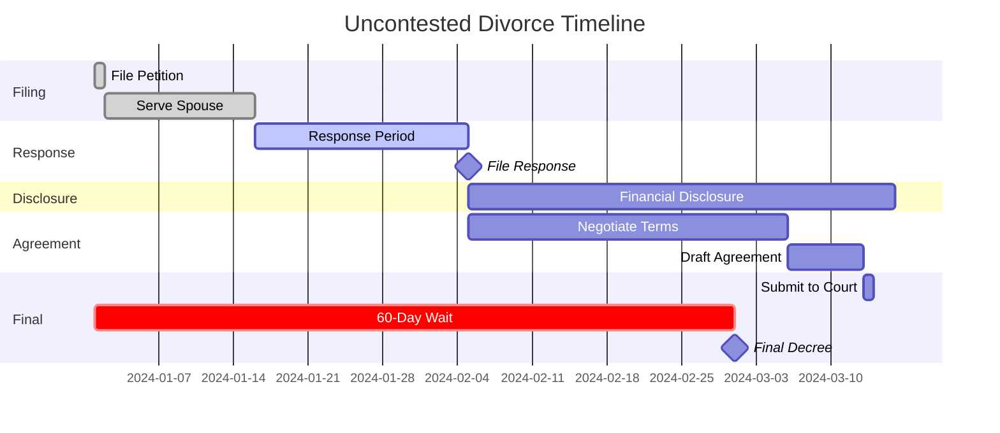
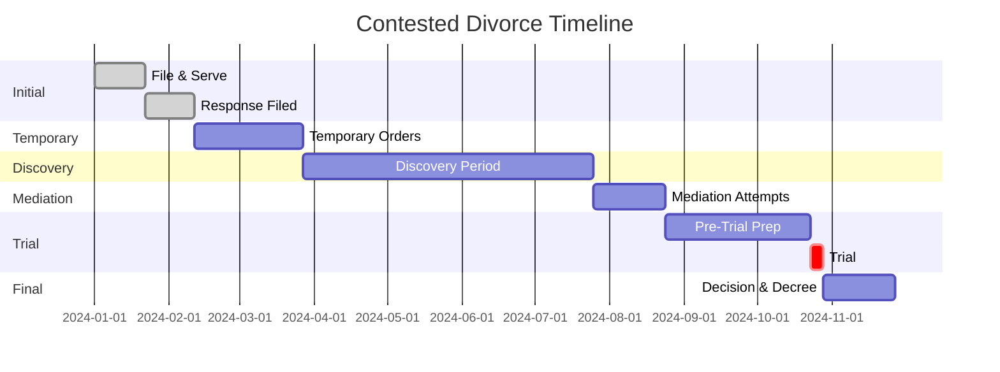
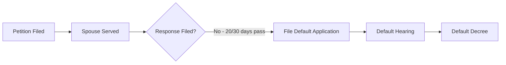
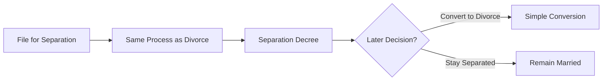
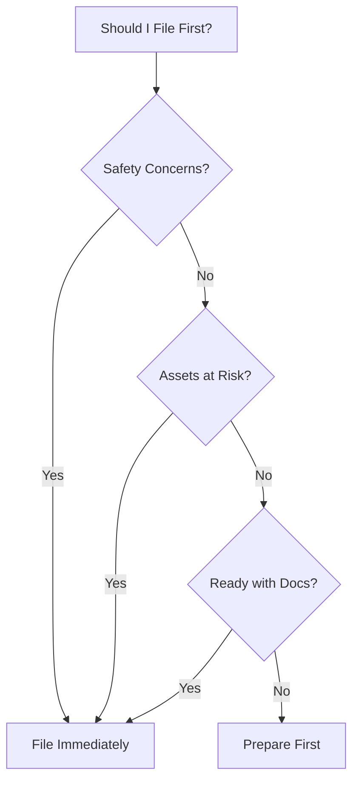
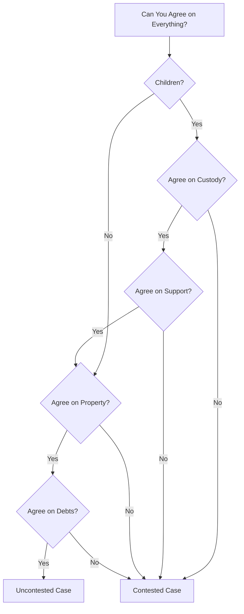

# Divorce Process Flowchart

## 🔍 Visual Overview

This flowchart shows the typical path of an Arizona divorce from start to finish. Your case may vary based on complexity and whether it's contested.

## 📊 The Complete Process

```mermaid
flowchart TD
    Start([Decide to Divorce]) --> Prep[Gather Documents]
    Prep --> File{Petitioner or<br/>Respondent?}
    
    File -->|Petitioner| FilePet[File Petition<br/>Pay $349]
    File -->|Respondent| WaitServe[Wait to be Served]
    
    FilePet --> GetSum[Get Summons<br/>from Clerk]
    GetSum --> Serve[Serve Spouse<br/>Within 120 days]
    
    Serve --> WaitResp[Wait for Response]
    WaitServe --> Served[Receive Papers]
    
    Served --> Respond{Respond Within<br/>20/30 days?}
    Respond -->|Yes| FileResp[File Response<br/>Pay $274]
    Respond -->|No| Default[Default Possible]
    
    WaitResp --> Check{Response<br/>Filed?}
    Check -->|No| Default
    Check -->|Yes| FileResp
    
    FileResp --> Disclosure[Financial Disclosure<br/>Due in 40 days]
    Default --> DefaultProc[Default Proceedings]
    
    Disclosure --> Temp{Need Temporary<br/>Orders?}
    Temp -->|Yes| TempMotion[File Motion]
    Temp -->|No| Negotiate
    
    TempMotion --> TempHear[Temporary Orders<br/>Hearing]
    TempHear --> TempOrder[Temporary Orders<br/>Issued]
    TempOrder --> Negotiate
    
    Negotiate --> Agree{Reach<br/>Agreement?}
    Agree -->|Yes| Consent[Draft Consent Decree]
    Agree -->|No| Discovery[Discovery Process]
    
    Discovery --> Mediation{Try<br/>Mediation?}
    Mediation -->|Yes| Med[Attend Mediation]
    Mediation -->|No| Trial
    
    Med --> MedAgree{Agreement<br/>Reached?}
    MedAgree -->|Yes| Consent
    MedAgree -->|No| Trial
    
    Consent --> Submit[Submit to Court]
    DefaultProc --> Submit
    
    Submit --> Review[Judge Reviews]
    Review --> Approve{Approved?}
    Approve -->|No| Fix[Fix Issues]
    Fix --> Submit
    Approve -->|Yes| Sign[Judge Signs Decree]
    
    Trial --> PreTrial[Pre-Trial Conference]
    PreTrial --> TrialDay[Trial Day]
    TrialDay --> Decision[Judge's Decision]
    Decision --> Sign
    
    Sign --> Wait60[Wait 60 Days<br/>from Service]
    Wait60 --> Final{60 Days<br/>Passed?}
    Final -->|No| KeepWait[Continue Waiting]
    KeepWait --> Final
    Final -->|Yes| Effective[Decree Effective]
    
    Effective --> End([Divorced])
    
    style Start fill:#f9f,stroke:#333,stroke-width:4px
    style End fill:#9f9,stroke:#333,stroke-width:4px
    style Default fill:#faa,stroke:#333,stroke-width:2px
    style Trial fill:#ffa,stroke:#333,stroke-width:2px
```

## ⏱️ Timeline Breakdown

### Uncontested Path (Green Route)

### Contested Path (Red Route)

## 🔄 Alternative Paths

### Default Divorce

### Legal Separation

## 📋 Document Checklist by Stage

### Starting Documents
- [ ] Petition for Dissolution
- [ ] Summons
- [ ] Preliminary Injunction
- [ ] Notice Documents
- [ ] Fee Waiver (if needed)

### Response Stage
- [ ] Response to Petition
- [ ] Counterclaim (if any)
- [ ] Certificate of Service

### Disclosure Stage
- [ ] Affidavit of Financial Info
- [ ] Tax Returns (2 years)
- [ ] Pay Stubs (6 months)
- [ ] Bank Statements (12 months)
- [ ] Other Financial Docs

### Settlement Stage
- [ ] Parenting Plan
- [ ] Child Support Worksheet
- [ ] Property Settlement
- [ ] Spousal Maintenance Terms

### Final Stage
- [ ] Consent Decree or Trial Order
- [ ] Final Child Support Order
- [ ] QDROs (if needed)
- [ ] Transfer Deeds

## 🚦 Decision Points

### Should You File First?

### Contested vs. Uncontested

## 💡 Tips for Each Stage

### Filing Stage
- Gather all documents first
- Consider temporary orders needs
- File in correct county
- Pay fees or get waiver

### Service Stage
- Use professional server
- Keep proof of service
- Don't delay - 120 day limit
- Consider acceptance of service

### Response Stage
- Calendar deadline immediately
- Respond to everything
- File counterclaims now
- Start financial gathering

### Negotiation Stage
- Stay business-like
- Focus on interests
- Consider mediation
- Document agreements

### Trial Stage
- Prepare thoroughly
- Organize exhibits
- Practice testimony
- Arrive early

## 🔗 Related Resources

- [Detailed Divorce Guide](../core-topics/Divorce.md)
- [Court Procedures](../procedures/Court Procedures.md)
- [Forms and Documents](Forms and Documents.md)
- [Timeline Calculator](Child Support Calculator.md)

## 📞 Get Help

- **Self-Help Center**: Form assistance
- **Court Clerk**: Procedural questions
- **Legal Aid**: If you qualify
- **Private Attorney**: Complex cases

---

**Navigation**: [← Forms and Documents](Forms and Documents.md) | [Property Division Worksheet →](Property Division Worksheet.md)

*Last updated: December 30, 2024*