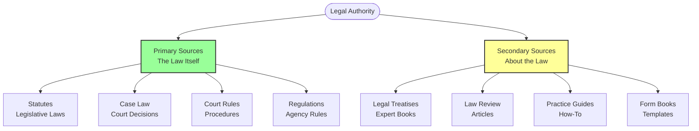
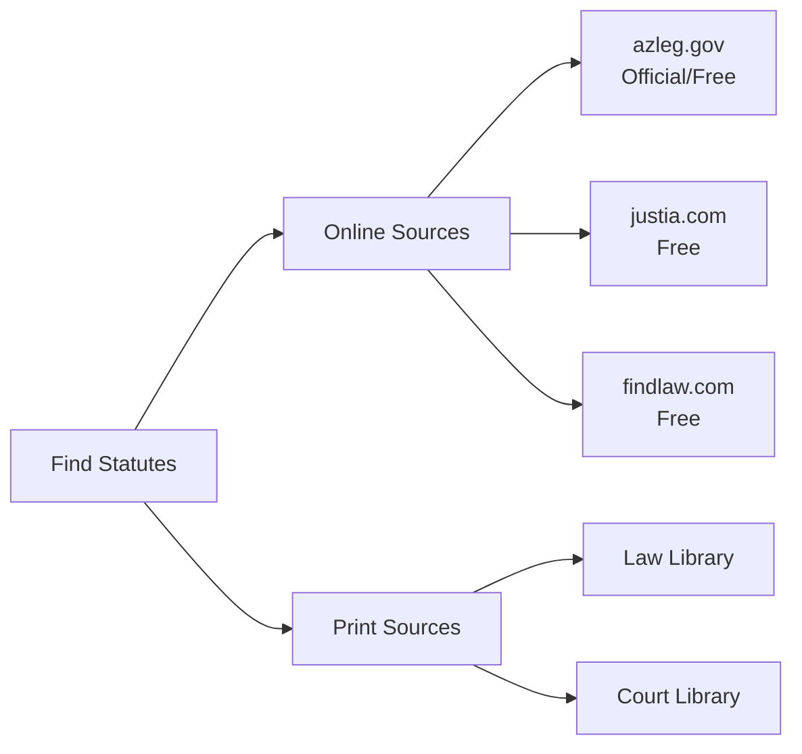
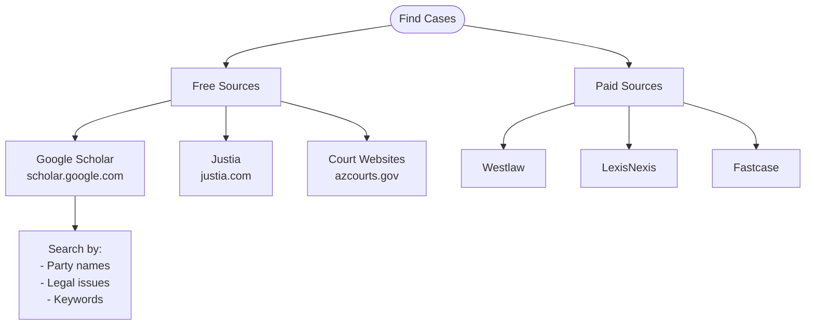
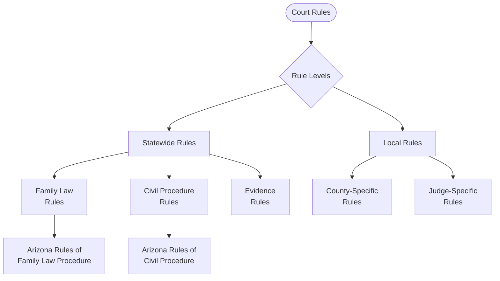
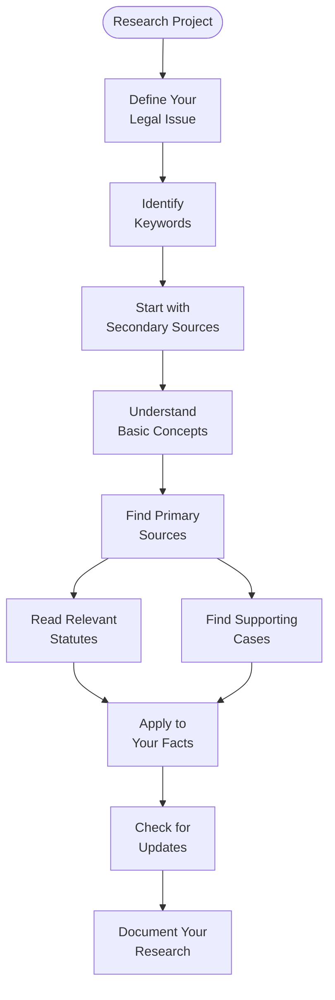
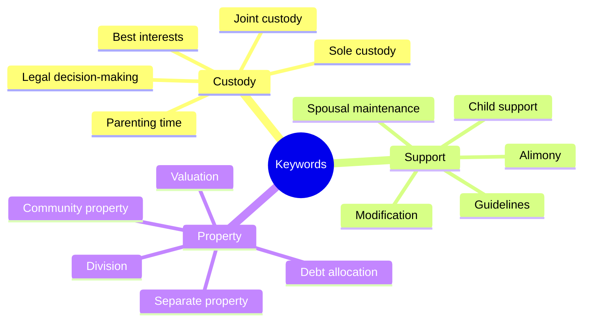
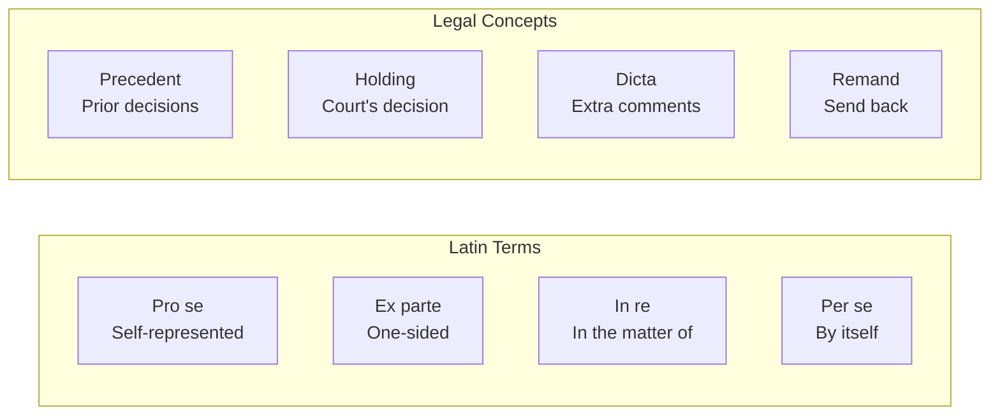
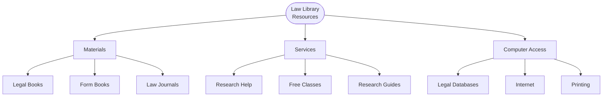
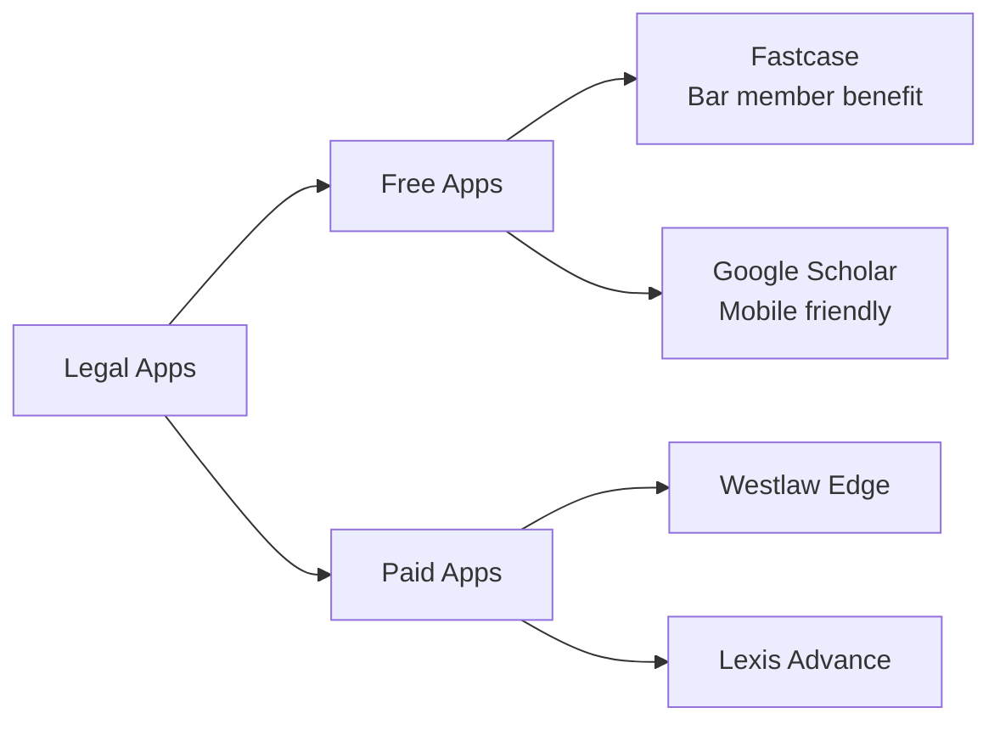
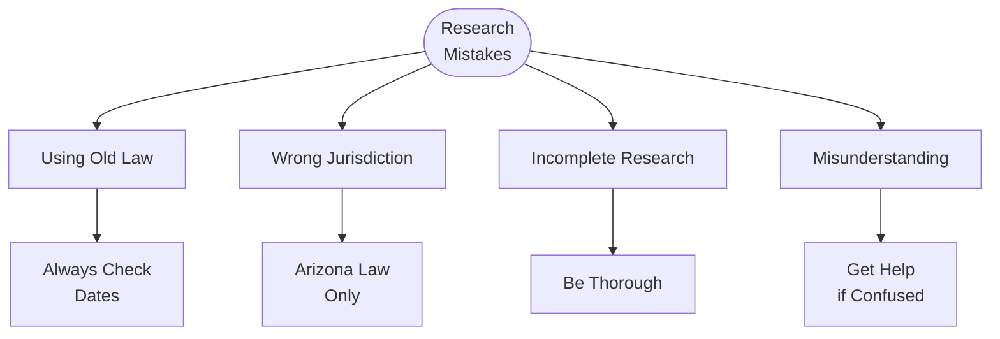

# Legal Research Guide

## 🔍 Legal Research Overview

Legal research helps you understand the laws that apply to your case. This guide shows you how to find and use Arizona family law resources effectively.

## 📊 Types of Legal Authority



## 📚 Arizona Family Law Statutes

### Where to Find Statutes



### Key Family Law Statutes (Title 25)

| Topic | Statute | What It Covers |
|-------|---------|----------------|
| **Divorce** | A.R.S. § 25-312 to 25-329 | Dissolution procedures |
| **Legal Decision-Making** | A.R.S. § 25-401 to 25-415 | Custody laws |
| **Parenting Time** | A.R.S. § 25-408 | Visitation rights |
| **Child Support** | A.R.S. § 25-500 to 25-544 | Support obligations |
| **Spousal Maintenance** | A.R.S. § 25-319 | Alimony rules |
| **Property Division** | A.R.S. § 25-318 | Community property |
| **Domestic Violence** | A.R.S. § 13-3601 | DV definitions |
| **Protective Orders** | A.R.S. § 13-3602 | Order procedures |

### How to Read a Statute Citation

```
A.R.S. § 25-403(A)(1)
  ↓     ↓    ↓   ↓  ↓
  |     |    |   |  └─ Subdivision
  |     |    |   └──── Subsection  
  |     |    └──────── Section number
  |     └───────────── Title (Family Law)
  └─────────────────── Arizona Revised Statutes
```

## 🏛️ Finding Case Law

### Understanding Case Citations

```
Smith v. Jones, 240 Ariz. 123, 456 P.3d 789 (2019)
   ↓       ↓      ↓    ↓    ↓     ↓    ↓     ↓
   |       |      |    |    |     |    |     └─ Year
   |       |      |    |    |     |    └─────── Page
   |       |      |    |    |     └──────────── Pacific Reporter
   |       |      |    |    └────────────────── Page
   |       |      |    └─────────────────────── Volume
   |       |      └──────────────────────────── Arizona Reports
   |       └─────────────────────────────────── Defendant
   └─────────────────────────────────────────── Plaintiff
```

### Where to Find Cases



### Important Arizona Family Law Cases

| Issue | Case | Key Holding |
|-------|------|-------------|
| **Custody Modification** | *Backstrand v. Backstrand* | Substantial change required |
| **Relocation** | *Owen v. Blackhawk* | Best interests analysis |
| **Spousal Maintenance** | *Schroeder v. Schroeder* | Reasonable needs test |
| **Property Division** | *Toth v. Toth* | Equitable doesn't mean equal |
| **Attorney Fees** | *Magee v. Magee* | Financial disparity factor |

## 📋 Court Rules

### Types of Rules



### Key Family Law Rules

| Rule | Topic | Why Important |
|------|-------|---------------|
| **Rule 1** | Scope and Purpose | Framework for all cases |
| **Rule 5** | Service of Papers | How to serve documents |
| **Rule 26.1** | Disclosure | What to exchange |
| **Rule 47** | Self-Representation | Your rights |
| **Rule 69** | Temporary Orders | Emergency relief |
| **Rule 76** | Default | Missing deadlines |
| **Rule 91** | Parenting Plans | Requirements |

## 🔎 Research Strategy

### Step-by-Step Research Process



### Research Checklist

- [ ] **Define the issue** clearly
- [ ] **List keywords** and synonyms
- [ ] **Check statutes** first
- [ ] **Find relevant cases**
- [ ] **Read court rules**
- [ ] **Verify current law**
- [ ] **Apply to your facts**
- [ ] **Document sources**

## 💡 Legal Research Tips

### Effective Keyword Searching



### Boolean Search Operators

| Operator | Function | Example |
|----------|----------|---------|
| **AND** | Both terms | custody AND modification |
| **OR** | Either term | alimony OR maintenance |
| **NOT** | Exclude term | custody NOT criminal |
| **" "** | Exact phrase | "best interests of child" |
| **( )** | Group terms | (custody OR visitation) AND modify |

## 📖 Understanding Legal Language

### Common Legal Terms



### Reading Case Law

**Case Structure:**
1. **Caption** - Parties and court
2. **Facts** - What happened
3. **Procedure** - How it got to court
4. **Issue** - Legal question
5. **Holding** - Court's answer
6. **Reasoning** - Why court decided
7. **Conclusion** - Final outcome

## 🏢 Using Law Libraries

### What Law Libraries Offer



### Arizona Law Libraries

**Maricopa County**
- Superior Court Law Library
- 101 W. Jefferson, Phoenix
- (602) 506-3461
- Open to public

**Pima County**
- Law Library for the Public
- 110 W. Congress, Tucson
- (520) 724-8456
- Free access

**State Law Library**
- 1700 W. Washington, Phoenix
- (602) 926-3870
- Public welcome

## 💻 Online Research Tools

### Free Legal Research Sites

| Website | Best For | Features |
|---------|----------|----------|
| **Google Scholar** | Case law | Free, comprehensive |
| **azleg.gov** | Arizona statutes | Official source |
| **Justia** | General research | User-friendly |
| **FindLaw** | Legal articles | Plain English |
| **CourtListener** | Federal cases | Audio arguments |
| **AVVO** | Legal guides | Q&A forum |

### Research Apps



## 📝 Organizing Your Research

### Research Documentation Template

```
LEGAL RESEARCH MEMO

Issue: [Your legal question]

Date: [Today's date]

1. RELEVANT STATUTES
   - A.R.S. § [number]: [summary]
   - Key language: "[quote]"

2. CASE LAW
   - Case name: [citation]
   - Facts similar to mine: [list]
   - Court held: [holding]
   - Applies because: [reasoning]

3. COURT RULES
   - Rule [number]: [requirement]
   - Deadline: [date]

4. CONCLUSION
   - The law says: [summary]
   - Applied to my case: [analysis]
   - I should: [action items]
```

## ⚠️ Research Warnings

### Common Mistakes



### Red Flags
- ❌ Case overruled or reversed
- ❌ Statute amended or repealed
- ❌ Different state's law
- ❌ Federal vs. state law
- ❌ Criminal vs. civil law

## 🤔 When You're Stuck

### Getting Research Help

1. **Law Librarians**
   - Can show you how to research
   - Cannot give legal advice
   - Free assistance

2. **Self-Help Center**
   - Basic legal information
   - Form assistance
   - Referrals

3. **Legal Aid**
   - If you qualify financially
   - Brief advice
   - Sometimes full help

4. **Limited Scope Attorney**
   - Research assistance
   - Case analysis
   - Hourly rates

## 📊 Research Time Estimates

| Task | Time Needed |
|------|-------------|
| **Basic statute search** | 30 minutes |
| **Finding relevant cases** | 2-4 hours |
| **Understanding concepts** | 1-2 hours |
| **Applying to facts** | 2-3 hours |
| **Writing summary** | 1-2 hours |
| **Total for issue** | 6-12 hours |

## 🔗 Quick Reference Links

### Statutes
- Arizona Revised Statutes: [azleg.gov](https://azleg.gov)
- Title 25 (Family): [Direct link](https://www.azleg.gov/arsDetail/?title=25)

### Cases
- Google Scholar: [scholar.google.com](https://scholar.google.com)
- Arizona Courts: [azcourts.gov](https://azcourts.gov)

### Rules
- Family Law Rules: [Download PDF](https://www.azcourts.gov/rules)
- Local Rules: Check county website

### Help
- State Bar Referral: 602-257-4434
- Legal Aid: 1-866-637-5341

## 🔗 Related Resources

- [Self-Representation Guide](Self-Representation Guide.md)
- [Court Forms Assistant](Court Forms Assistant.md)
- [Legal Representation](../procedures/Legal Representation.md)
- [Court Procedures](../procedures/Court Procedures.md)

---

**Navigation**: [← Self-Representation Guide](Self-Representation Guide.md) | [Common Mistakes Guide →](Common Mistakes Guide.md)

*Last updated: December 30, 2024*