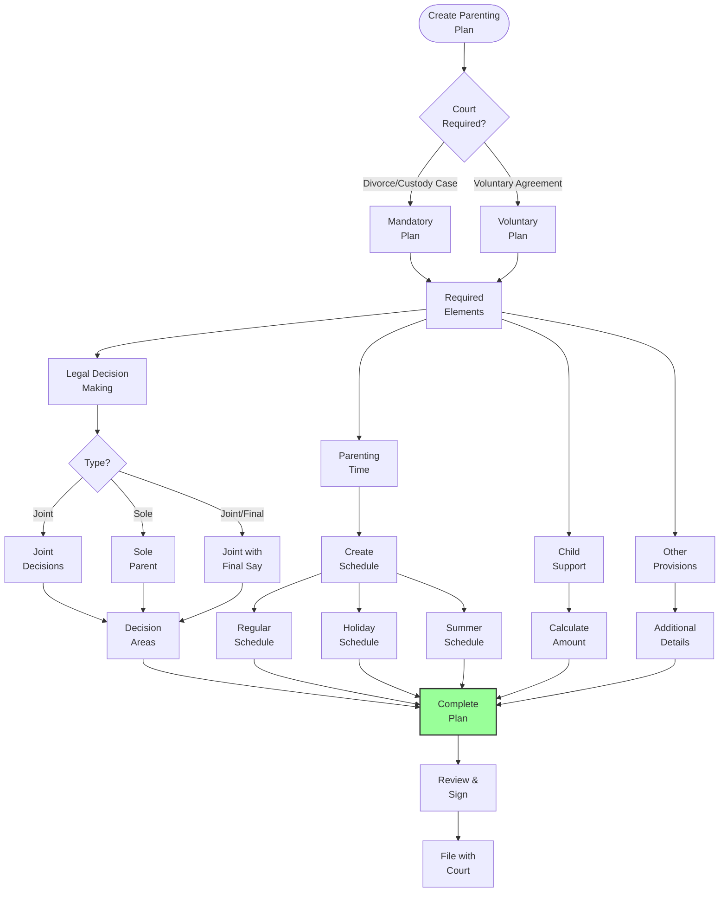
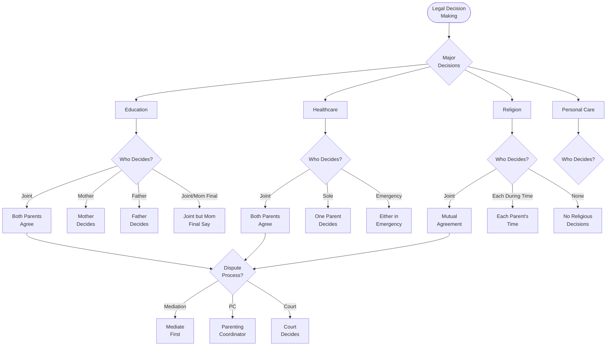
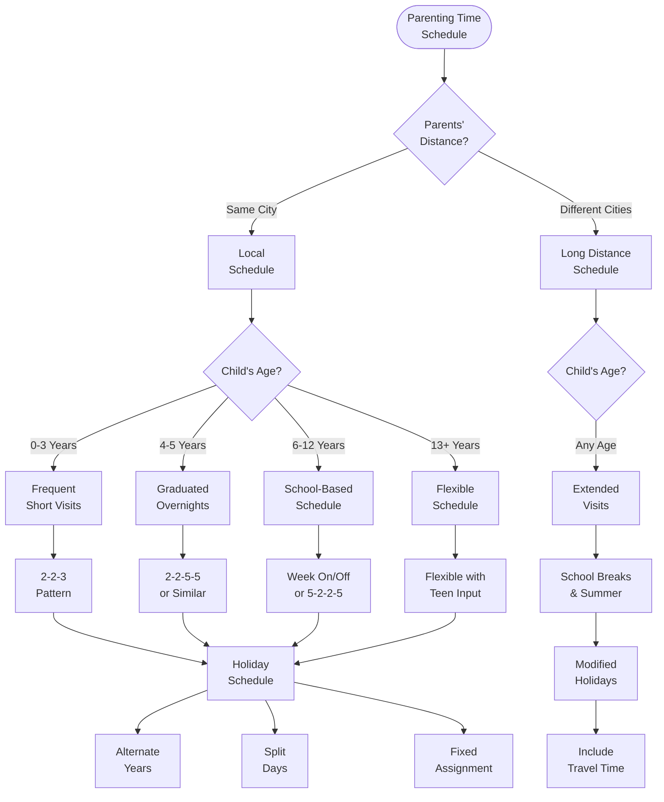
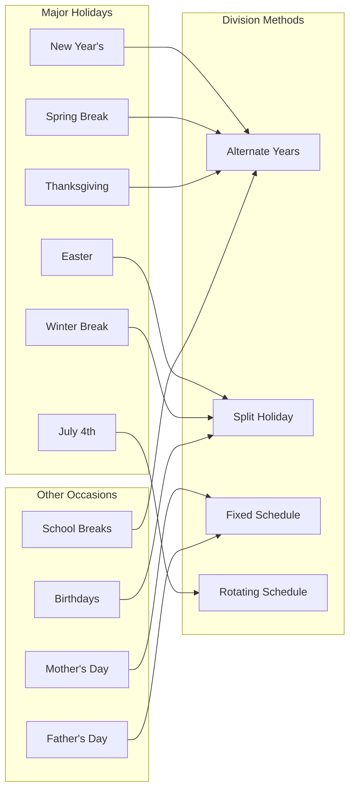
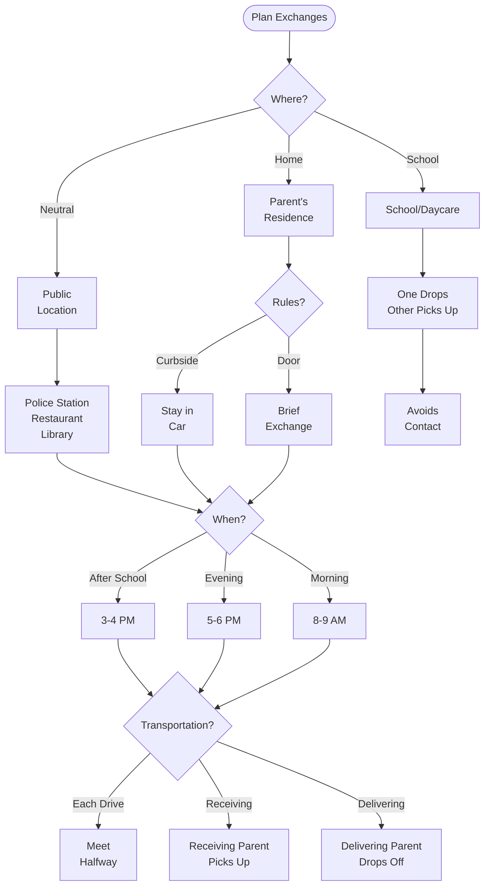
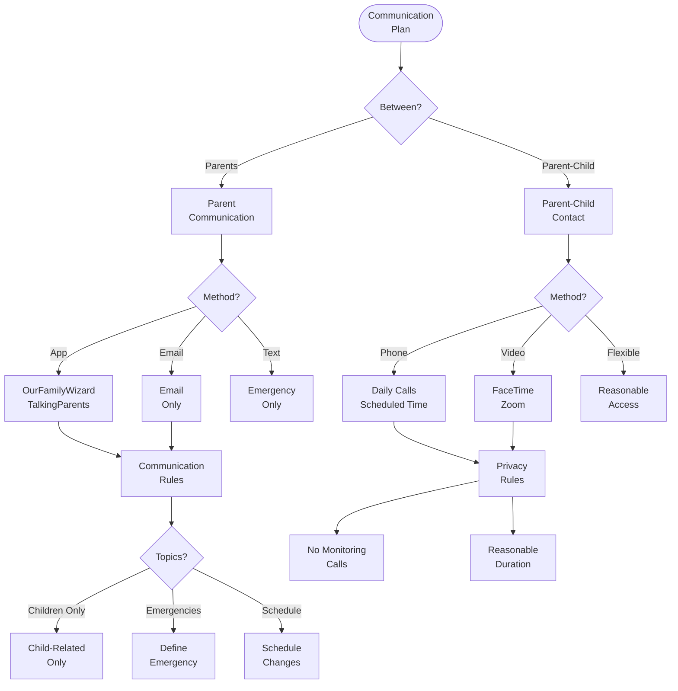
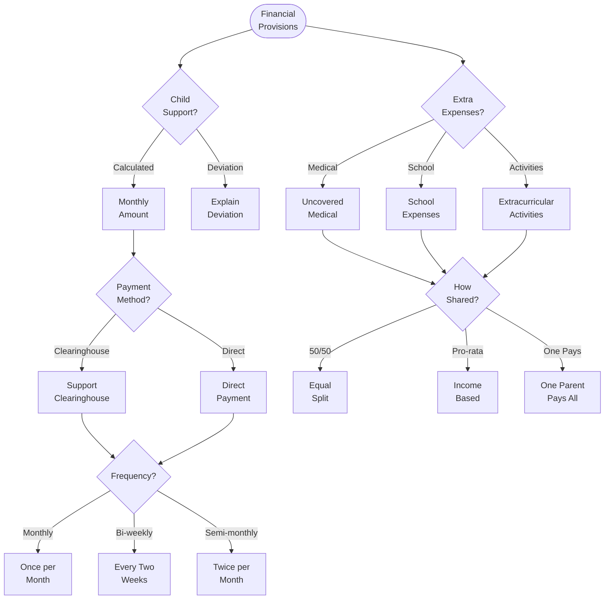
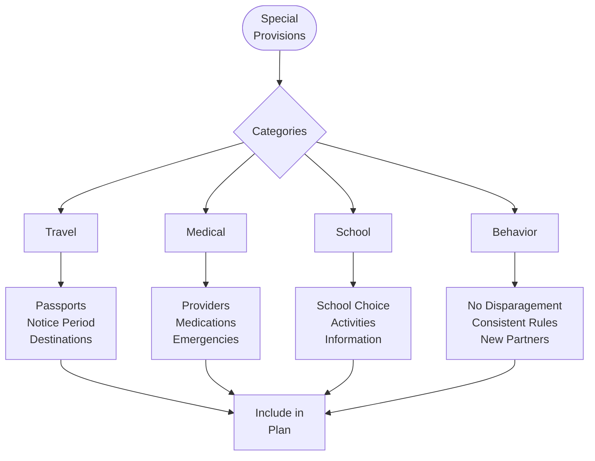
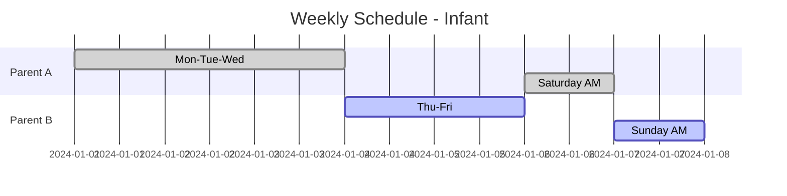
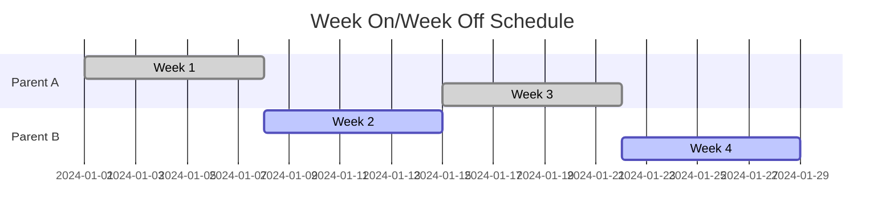

# Parenting Plan Creation Flowchart

## 🔍 Visual Overview

This flowchart guides parents through creating a comprehensive parenting plan that addresses all required elements under Arizona law and promotes the best interests of children.

## 📊 Parenting Plan Overview

## 🏛️ Legal Decision-Making Structure

## 📅 Creating Parenting Time Schedule

## 🎄 Holiday Schedule Planning

## 🚗 Exchange Logistics

## 📱 Communication Plan

## 💰 Financial Provisions

## 📋 Special Provisions Checklist

## 🎯 Age-Appropriate Schedule Examples

### Infants (0-1 year)

### School Age (6-12 years)

## 💡 Best Practices

### Do's ✅
1. **Be specific** about times and locations
2. **Consider child's needs** first
3. **Plan for growth** and changes
4. **Include backup plans**
5. **Address all scenarios**

### Don'ts ❌
1. **Leave things vague**
2. **Make it too rigid**
3. **Forget holidays**
4. **Ignore child's activities**
5. **Use as weapon**

## 📝 Required Elements Checklist

### Legal Decision-Making
- [ ] Education decisions
- [ ] Healthcare decisions
- [ ] Religious decisions
- [ ] Personal care decisions
- [ ] Dispute resolution method

### Parenting Time
- [ ] Regular schedule
- [ ] Holiday schedule
- [ ] Summer schedule
- [ ] Birthday plans
- [ ] Exchange details

### Communication
- [ ] Parent-to-parent method
- [ ] Parent-child contact
- [ ] Emergency procedures
- [ ] Information sharing
- [ ] Response times

### Financial
- [ ] Child support amount
- [ ] Payment method
- [ ] Extra expenses
- [ ] Tax deductions
- [ ] Insurance coverage

### Other Provisions
- [ ] Travel restrictions
- [ ] Relocation notice
- [ ] Right of first refusal
- [ ] Childcare providers
- [ ] Modification process

## 🔗 Related Resources

- [Parenting Plan Template](Forms and Documents.md#parenting-plan)
- [Child Custody Guide](../core-topics/Child Custody.md)
- [Parenting Time Details](../special-situations/Parenting Time.md)
- [Communication Tools](../resources/Financial Issues.md#communication-apps)

## 📞 Get Help

- **Mediators**: Help create agreements
- **Parenting Coordinators**: High-conflict cases
- **Family Therapists**: Child adjustment
- **Legal Aid**: If you qualify

---

**Navigation**: [← Modification Process Flowchart](Modification Process Flowchart.md) | [Tax Considerations →](Tax Considerations.md)

*Last updated: December 30, 2024*