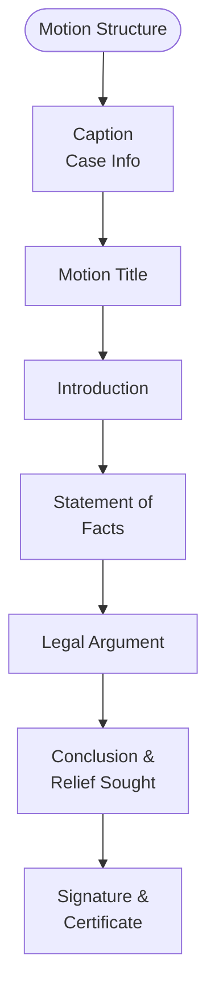

# Self-Representation Guide

## 🔍 Should You Represent Yourself?

Before deciding to represent yourself (called "pro se" or "pro per"), consider these factors:

## 📚 Understanding the Basics

### Your Rights as a Self-Represented Litigant

**You Have the Right To:**
- ✅ Represent yourself in court
- ✅ File documents
- ✅ Present evidence
- ✅ Cross-examine witnesses
- ✅ Make legal arguments
- ✅ Appeal decisions

**You Are Expected To:**
- ⚖️ Follow all rules and procedures
- ⚖️ Meet all deadlines
- ⚖️ Present proper evidence
- ⚖️ Act professionally
- ⚖️ Know applicable law
- ⚖️ Complete correct forms

### Key Legal Terms You Must Know

| Term | Definition | Why It Matters |
|------|------------|----------------|
| **Petitioner** | Person who starts the case | You file first |
| **Respondent** | Person who responds | You respond to petition |
| **Service** | Legal delivery of documents | Must be done correctly |
| **Motion** | Request to the court | How you ask for things |
| **Order** | Judge's decision | What you must follow |
| **Hearing** | Court proceeding | When you present case |
| **Evidence** | Proof for your case | What judge considers |
| **Discovery** | Information exchange | Learning other side's case |

## 🏛️ Courtroom Etiquette & Procedures

### How to Dress

```mermaid
flowchart LR
    subgraph "Appropriate ✅"
        A1[Business Casual]
        A2[Collared Shirt]
        A3[Dress Pants/Skirt]
        A4[Closed-toe Shoes]
        A5[Conservative Colors]
    end
    
    subgraph "Not Appropriate ❌"
        B1[Shorts/Tank Tops]
        B2[Flip-flops]
        B3[Hats/Sunglasses]
        B4[Revealing Clothing]
        B5[Offensive Graphics]
    end
```

### Courtroom Behavior

**Do's ✅**
1. **Arrive early** (30 minutes)
2. **Turn off phone**
3. **Stand when judge enters**
4. **Address judge as "Your Honor"**
5. **Wait your turn to speak**
6. **Be respectful to everyone**
7. **Bring all documents**

**Don'ts ❌**
1. **Interrupt anyone**
2. **Argue with judge**
3. **Make faces or gestures**
4. **Bring children** (unless required)
5. **Chew gum or eat**
6. **Use profanity**
7. **Make personal attacks**

## 📋 Preparing Your Case

### Case Preparation Flowchart

### Essential Case Notebook Sections

1. **Case Information**
   - Case number
   - Judge's name
   - Important dates
   - Attorney info (if any)

2. **Chronology**
   - Timeline of events
   - Key dates
   - Important incidents

3. **Documents**
   - All filed papers
   - Evidence copies
   - Correspondence
   - Court orders

4. **Evidence**
   - Document list
   - Witness list
   - Exhibit list
   - Photos/recordings

5. **Legal Research**
   - Relevant statutes
   - Case law
   - Court rules
   - Legal arguments

6. **Questions/Notes**
   - For witnesses
   - For yourself
   - Key points
   - Reminders

## 🗣️ Presenting Your Case

### Opening Statement Structure

**Example Opening:**
"Your Honor, I'm [name], the petitioner. We were married for 10 years and have two children. I'm seeking joint legal decision-making with equal parenting time because both parents have been actively involved in the children's lives and this arrangement is in their best interests. I'll show that I've been the primary caregiver and can provide a stable home."

### Presenting Evidence

### How to Object

**Common Objections:**

| Objection | When to Use | What to Say |
|-----------|-------------|-------------|
| **Relevance** | Not related to case | "Objection, relevance" |
| **Hearsay** | Out-of-court statement | "Objection, hearsay" |
| **Speculation** | Witness guessing | "Objection, speculation" |
| **Asked and Answered** | Repetitive question | "Objection, asked and answered" |
| **Argumentative** | Arguing not asking | "Objection, argumentative" |

## 📝 Legal Writing Tips

### Motion Writing Structure

### Writing Do's and Don'ts

**Do's ✅**
- Use clear, simple language
- Number your paragraphs
- State facts objectively
- Cite legal authority
- Be concise
- Proofread carefully

**Don'ts ❌**
- Use emotional language
- Make personal attacks
- Include opinions as facts
- Write in ALL CAPS
- Use excessive exclamation points
- Submit handwritten documents (if possible)

## 🚨 Common Self-Representation Mistakes

### Top 10 Mistakes to Avoid

## 📅 Managing Deadlines

### Deadline Tracking System

### Critical Deadlines

| Action | Deadline | Consequences of Missing |
|--------|----------|------------------------|
| **Respond to Petition** | 20-30 days | Default judgment |
| **Financial Disclosure** | 40 days | Sanctions |
| **Discovery Responses** | 30-40 days | Court orders, fees |
| **Motion Response** | Varies | Motion granted |
| **Appeal** | 30 days | Lose right to appeal |

## 💻 Online Resources

### Research Tools

1. **Arizona Revised Statutes**
   - azleg.gov
   - Title 25 (Family Law)
   - Free access

2. **Court Rules**
   - azcourts.gov
   - Family Law Rules
   - Local rules

3. **Case Law**
   - Google Scholar
   - Court opinions
   - Free access

4. **Court Forms**
   - azcourts.gov/selfhelp
   - azturbocourt.gov
   - County websites

### Self-Help Centers

**Services Provided:**
- Form selection assistance
- Basic procedural guidance
- Computer/printer access
- Court navigation help
- Referral information

**Cannot Provide:**
- Legal advice
- Form completion
- Case strategy
- Document review
- Representation

## 🤝 Working with the Other Side

### Communication Guidelines

### Negotiation Tips

1. **Focus on interests**, not positions
2. **Separate people** from problems
3. **Generate options** for mutual gain
4. **Use objective** criteria
5. **Know your BATNA** (best alternative)
6. **Document agreements**

## 📊 Trial Preparation Checklist

### Two Weeks Before Trial
- [ ] Finish all discovery
- [ ] Organize all exhibits
- [ ] Prepare witness list
- [ ] Create trial notebook
- [ ] Visit courtroom
- [ ] Practice presentation

### One Week Before
- [ ] Confirm witnesses
- [ ] Copy all exhibits (4 sets)
- [ ] Prepare questions
- [ ] Review all documents
- [ ] Plan what to wear
- [ ] Arrange time off work

### Day Before
- [ ] Pack trial materials
- [ ] Charge phone
- [ ] Get directions
- [ ] Prepare parking money
- [ ] Review key points
- [ ] Get good sleep

### Day of Trial
- [ ] Arrive 30 minutes early
- [ ] Check in with clerk
- [ ] Turn off phone
- [ ] Review notes
- [ ] Stay calm
- [ ] Be respectful

## 🔧 Technology Tips

### Virtual Hearings

**Technical Requirements:**
- Stable internet
- Computer with camera
- Quiet location
- Good lighting
- Plain background
- Test beforehand

**Virtual Court Etiquette:**
- Dress professionally
- Mute when not speaking
- Look at camera
- No multitasking
- Have documents ready
- Test technology early

## 🆘 When to Get Help

### Consider an Attorney When:

### Types of Legal Help

1. **Full Representation**
   - Attorney handles everything
   - Most expensive
   - Best for complex cases

2. **Limited Scope**
   - Attorney helps with parts
   - You handle rest
   - More affordable

3. **Consultation Only**
   - One-time advice
   - Case strategy
   - Document review

4. **Legal Aid**
   - Income-qualified
   - Free representation
   - Limited availability

## 📞 Resources & Support

### Self-Help Resources
- **Court Self-Help Centers**: Free guidance
- **Law Libraries**: Research assistance
- **Legal Aid**: 1-866-637-5341
- **State Bar Referral**: 602-257-4434

### Online Support
- **AZ Courts Help**: azcourts.gov/selfhelp
- **Turbo Court**: azturbocourt.gov
- **Legal Forms**: azcourtforms.gov

### Emergency Resources
- **DV Hotline**: 1-800-799-7233
- **Crisis Line**: 988
- **Emergency**: 911

## 🔗 Related Resources

- [Court Forms Assistant](Court Forms Assistant.md)
- [Court Procedures Guide](../procedures/Court Procedures.md)
- [Legal Representation Options](../procedures/Legal Representation.md)
- [Divorce Process Flowchart](Divorce Process Flowchart.md)

---

**Navigation**: [← Court Forms Assistant](Court Forms Assistant.md) | [Legal Research Guide →](Legal Research Guide.md)

*Last updated: December 30, 2024*